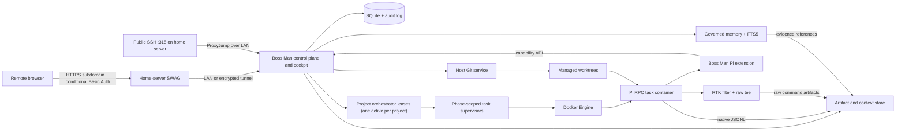
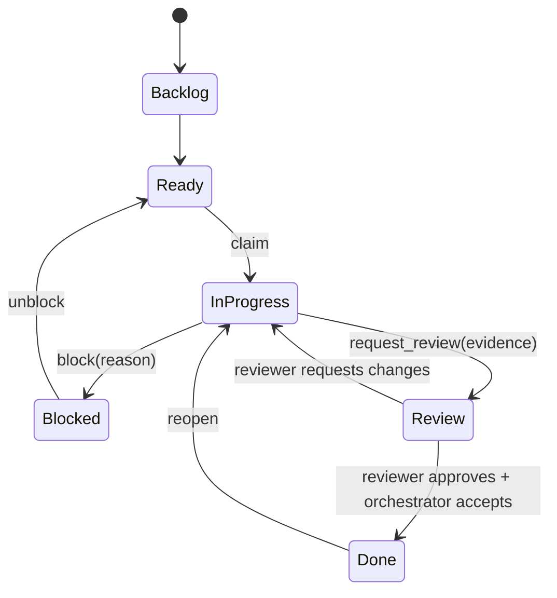
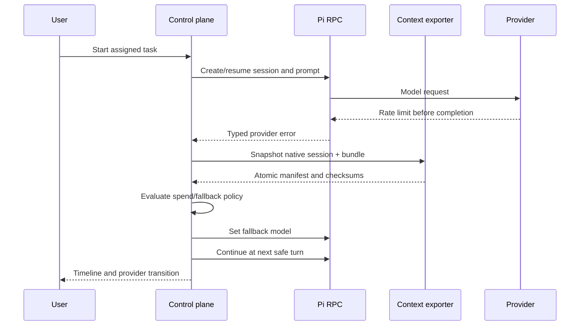

# Boss Man v2 technical design

Status: Direct-Pi foundation; Phase 1 complete; Phase 2 active

Last updated: 2026-07-18

## Context and evidence

This design is based on the following upstream revisions:

- [`weblue/boss-man@59f8282`](https://github.com/weblue/boss-man/tree/59f8282654f9b4cea90f2ba830aa6d56106e25b4)
- [`weblue/inspector-gadget@3df3938`](https://github.com/weblue/inspector-gadget/tree/3df39382ceb147aa411f9c578ef4131fc91912f2)
- [`earendil-works/pi@v0.80.9`](https://github.com/earendil-works/pi/tree/2d16f92973230a7e095aa984f150ba8702784f50)

The current Boss Man already has a useful SQLite task graph and event history, an SSE-backed web UI, Docker/Sandcastle execution, and worktree-based runs. Its continuation mechanism starts a fresh harness process from a prompt assembled from a rolling LLM summary, recent turns, tasks, and memories. The raw events remain available, but they are not treated as a portable, versioned session artifact.

The existing MCP endpoint grants task mutation to the orchestrator while intentionally limiting worker sessions to a read-only prime operation. The v2 problem is therefore not simply “add update”; it is to add server-enforced, capability-scoped worker mutations and audit them.

Inspector Gadget demonstrates useful remote host setup through Tailscale, SSH, tmux, and cmux. Its Pi copy command exports human-readable conversation content, not the full native session, tool evidence, or a pre-compaction artifact. Its Sandcastle extension also leaves lifecycle policy inside the harness.

Inspector Gadget also pins and installs RTK, wires its Pi extension, and instructs agents to use RTK filters. Current RTK supports Pi command interception, full-output tee artifacts, bypasses, and local savings metrics. This is directly useful when lossless raw evidence remains separate from filtered model context.

The Pi ecosystem now also contains several local memory extensions. [`pi-persistent-intelligence`](https://github.com/Mont3ll/pi-persistent-intelligence) is the closest architectural match because it uses canonical JSONL, rendered Markdown, evidence, tombstones, and patch-governed durable changes. It is a useful spike candidate, but its current maturity is too low to make Boss Man's custody or recovery guarantees depend on it.

## Architectural decision

Build a Pi-native control plane that reuses the proven product concepts from Boss Man, but replace the execution, UI, task-authorization, and context seams instead of incrementally wrapping Sandcastle.

Boss Man has one durable lifecycle authority: the central API and its SQLite
transaction log. One leased orchestrator process per project may coordinate
its task agents, but it never owns a competing durable database. Pi JSONL
remains authoritative session evidence.

## High-level architecture



The control plane is authoritative for tasks, policies, runs, workspaces, and artifact provenance. Pi's JSONL is authoritative for native session history. Neither database is reconstructed from an LLM summary.

Project orchestrators may be ordinary daemons or tmux-backed processes managed with cmux or SSH. They register, heartbeat, and receive commands through the central API. The API rejects a competing live lease for the same project. Each task-agent run records exactly one initial phase (`implementation`, `test`, or `review`); a phase change creates a new run rather than silently broadening the current agent's authority.

## Components

### Control-plane API

Responsibilities:

- authenticated private web and API access;
- project, task, dependency, policy, and attention state;
- capability issuance to runs;
- append-only audit events and current-state projections;
- structured event streaming to the browser;
- run lifecycle and recovery coordination;
- provider/model policy evaluation at safe boundaries;
- artifact indexing and download.
- project-orchestrator registration, lease heartbeat, expiry, and command authority.

The selected direct path owns this API rather than delegating lifecycle to a second session manager. The closure implementation uses a small Node HTTP/SQLite seam to prove transactions; Hono, React, and a supported SQLite binding remain reasonable production choices after the closure gates. `UI.md` defines the required cockpit independently of the server framework.

### Run supervisor

The supervisor creates one managed Pi process per active session/run inside a container and communicates directly with `pi --mode rpc`. It never treats terminal scraping as authoritative. It owns:

- container create/start/stop/inspect/remove;
- resolving the centrally authorized provider/model/thinking policy and passing
  it to Pi at startup;
- Pi RPC requests, responses, and notifications;
- heartbeats and lifecycle reconciliation;
- turn boundaries and idempotency keys;
- model switch and retry decisions;
- log and event ingestion;
- context snapshot triggers.

A browser reconnect only resubscribes to control-plane events. It has no ownership of the underlying process.

### Boss Man Pi extension

The extension is deliberately small and installed into every managed Pi runtime. It should use Pi's documented extension APIs rather than patching Pi internals.

It provides:

- `boss_task_get`
- `boss_task_claim`
- `boss_task_progress`
- `boss_task_block`
- `boss_task_create_child`
- `boss_task_request_review`
- `boss_review_submit`
- `boss_context_snapshot`
- `boss_context_spawn_child`
- `boss_memory_search`
- `boss_memory_propose`
- `boss_git_status`
- `boss_git_diff`
- `boss_git_checkpoint_request`
- `boss_git_commit_request`

Every mutating call carries a short-lived run capability. The server derives project, task, agent role, and permitted transitions from that capability; it never trusts IDs or roles supplied by the model.

The extension listens to `session_before_compact` and blocks automatic compaction until a pre-compaction snapshot succeeds. It also asks for snapshots at turn end, fork/handoff, model switch, provider failure, and manual export. Where a Pi hook cannot safely perform filesystem coordination, it sends a blocking request to the supervisor and waits for acknowledgement.

### RTK output layer

Install a pinned, checksum-verified RTK binary and a small Boss Man Pi interception extension in the agent image. Disable telemetry by default. The extension executes each Bash command once, writes ephemeral raw output, runs the pinned RTK `log` filter, and returns filtered output to Pi. The daemon redacts and ingests both forms before deleting the ephemeral originals.

For every intercepted command, record:

- original and rewritten command identity, with secret-bearing arguments redacted;
- exit status and timing;
- filtered output delivered to Pi;
- raw output artifact checksum and location;
- RTK version/filter and reported savings;
- whether filtering was bypassed or failed.

Use complete raw capture for managed runs because complete-session retention and auditability outweigh the disk savings of failure-only capture. The standalone contract retains `tee.mode = "always"`, but the selected container path uses the Boss Man wrapper: RTK 0.42.3's Linux tee behavior did not reliably emit a raw file for direct commands in the pinned image. The wrapper preserves single execution and makes ingestion explicit. RTK 0.42.3 also requires `max_files` and `max_file_size` during configuration deserialization, and the pinned image includes `make` because RTK's `make` rewrite still depends on that executable. The artifact quota system handles growth. The UI provides filtered output by default and one-click redacted raw access. `rtk proxy` remains the diagnostic escape hatch.

Do not route control-plane-owned Git mutations through RTK. Tests and build commands may be filtered for agent context, but merge/review policy consumes their exit status plus raw evidence, not the summary alone.

### Context exporter

The exporter is deterministic application code, not a model or prompt. Its outputs are immutable, content-addressed snapshots.

Proposed layout:

```text
artifacts/context/<session-id>/<snapshot-id>/
  manifest.json
  native.pi-session.jsonl
  branch.messages.jsonl
  task.json
  decisions.json
  memory.records.jsonl
  context-receipt.json
  artifacts.json
  git.json
  checksums.sha256
```

`manifest.json` contains a schema version, exporter version, identifiers, trigger, timestamps, selected Pi leaf/branch, model history, source checksums, and references to every member. Files are written to a temporary directory, flushed, checksummed, and atomically renamed before success is acknowledged.

The initial normalized schema should preserve typed Pi entries rather than flattening everything into chat text. Unknown future entry types are copied as opaque typed records so an older exporter does not silently discard them.

The native JSONL supports exact Pi resume/import. The normalized files support inspection, provider changes within Pi, curated child context, and future migrations. Generated summaries may be attached later as optional artifacts but have no role in snapshot validity.

Pi allocates a native session path before it necessarily flushes the file. For pre-conversation and user-only boundaries, the exporter serializes `SessionManager.getHeader()` plus `getEntries()` into the same versioned JSONL shape when the file is absent. The first tested hook where the submitted user message is already persisted in `SessionManager` is `context`; `before_agent_start` and `turn_start` are too early. The synthesized snapshot must reopen through the pinned upstream `SessionManager` before it is accepted.

### Session import and child context

Pi currently exposes native resume/import and SDK session management. Boss Man should use those mechanisms instead of recreating conversation state in a system prompt.

- **Same-session resume:** reopen the managed native JSONL by session ID.
- **Imported resume:** copy and open a validated native JSONL, recording its source manifest.
- **Model switch:** checkpoint, change the model between turns, then continue the same Pi session.
- **Full-context child:** fork the selected Pi session branch.
- **Bundle child:** create a new Pi session with a persistent context message referencing a verified bundle and selected artifacts.
- **Fresh child:** create a new session with task instructions and explicit artifact references only.

For bundle mode, avoid injecting an unbounded transcript into the model window. The child receives a concise deterministic manifest plus tools for retrieving selected records and artifacts. The user or orchestration policy chooses which bundle sections are eager versus on-demand.

The current community `pi-subagents` package already demonstrates session forking, worktrees, artifacts, background agents, model fallbacks, and context builders. It should be evaluated as an upstream dependency or behavioral reference during a time-boxed spike. Its repository did not advertise an SPDX license in the inspected metadata, so no source should be copied until licensing is confirmed.

### Governed memory and retrieval

Boss Man separates four layers that memory products often conflate:

1. **Canonical evidence:** append-only Pi sessions, task/run/audit events, raw tool results, artifacts, Git references, and snapshot manifests. This is lossless, retained until explicit deletion, and independent of every memory library.
2. **Governed durable memory:** typed records with scope, provenance, confidence, status, author, evidence links, staleness metadata, and supersession/tombstone relationships. Mutations are append-only events projected into current state and an inspectable Markdown view.
3. **Derived retrieval:** SQLite FTS5/BM25 is the required model-less index. Optional embeddings, `sqlite-vec`, or an external local index may be added behind a versioned adapter; every derived index can be deleted and rebuilt.
4. **Optional intelligence:** model-assisted extraction, consolidation, semantic reranking, and graph construction may propose candidates or improve ranking. None may silently mutate active memory or become necessary for export, resume, or audit.

Initial memory record fields:

```text
id, schema_version, type, scope_type, scope_id, status,
title, body, confidence, author_type, author_id,
source_refs[], created_at, updated_at, valid_from, expires_at,
supersedes_id, contested_by[], tags[], content_hash
```

The source references point to immutable event IDs, artifact checksums, Pi session entry IDs/line anchors, task revisions, or Git revisions. Retrieval returns records plus a scored explanation; the context assembler writes the final selection to a `context-receipt.json` artifact before the prompt is sent. That receipt records query terms, filters, index version, memory IDs, source references, token estimate, exclusions, and whether retrieval used FTS, optional semantic ranking, or an explicit task attachment.

Memory mutation uses the same capability and optimistic-concurrency pattern as tasks. Workers can propose within their assigned project/task scope. A separate policy action promotes, contests, supersedes, or tombstones a candidate. Repository content and model-generated text are low-trust data: they cannot auto-promote identity/global rules, and retrieved content is delimited as evidence rather than concatenated into the system prompt as instructions. Secret scanning occurs before persistence, while the event records that a rejection or redaction occurred.

The default context assembler is deterministic and budgeted. It starts from explicit task and dependency links, then active project constraints/decisions, applicable runbooks, recent failed approaches, and FTS matches. It excludes superseded/rejected records, labels contested/stale records, and exposes why each item was selected. Full session forks remain available when exact conversational context is more appropriate than retrieval.

The Phase 0/3 memory spike compares two paths:

- embed or adapt the MIT-licensed `pi-persistent-intelligence` contract while Boss Man retains authority, scopes, audit, export, and version pinning; or
- implement the thin contract directly in the Boss Man database and Pi extension, borrowing its governance model without taking a runtime dependency.

The acceptance criterion is not feature count. The selected path must support deterministic export/import, FTS-only operation, deletion/rebuild of indexes, evidence-linked retrieval receipts, task-scoped capabilities, and no automatic package updates. `pi-memctx`, `pi-hermes-memory`, Basic Memory, Graphiti, Mem0, and similar systems remain references or optional adapters rather than canonical stores.

### Task and audit store

SQLite is appropriate for one always-on host if all writes pass through one control-plane service and transactions remain short. Enable WAL, foreign keys, regular online backup, and startup integrity checks.

Core projections:

- `topics`
- `projects`
- `tasks`
- `task_dependencies`
- `task_assignments`
- `sessions`
- `runs`
- `workspaces`
- `providers`
- `model_policies`
- `artifacts`
- `attention_items`
- `orchestrator_conversations`
- `source_attachments`
- `source_snapshots`
- `task_origins`

Core append-only records:

- `topic_events`
- `conversation_events`
- `task_events`
- `run_events`
- `session_events`
- `memory_events`
- `audit_events`

Additional memory projections and indexes:

- `memory_records`
- `memory_candidates`
- `memory_relationships`
- `memory_evidence_refs`
- `memory_fts` (FTS5 virtual table)
- `context_receipts`

Each mutation has an idempotency key and expected projection version. Conflicting versions return a typed conflict; agents must reread rather than overwrite. Deletion is represented by a tombstone where historical provenance matters.

Task state machine:



Capabilities constrain transitions by role. An implementing worker can mutate
its assignment and descendants but cannot approve itself. The orchestrator
starts a separate read-only reviewer session against a fixed revision.
Reviewer output is a structured artifact and task event. After approval and
policy-required validation, the orchestrator may mark the task Done and create
a merge request without human acceptance. Actual merge/rebase/push remains a
separate Phase 2 policy action. A human can require an integration hold for a
project/branch or a decision gate for named risk categories.

The merge policy evaluates changed paths, task risk, independent review, test plan, command results, unresolved findings, conflicts, and repository policy. Documentation-only work may legitimately omit tests; behavior changes normally require regression coverage; cross-boundary changes normally require integration coverage. Any omission carries an explicit reviewer-approved rationale.

Before Done or merge, the policy engine also evaluates human-decision categories. Foundation or fork changes, public contracts and durable schemas, authentication/trust boundaries, secrets strategy, public network exposure, destructive migrations, production infrastructure, external paid services, licenses, retention, and replacement of major runtimes/storage/core dependencies produce a typed `decision_required` event. An ADR proposal can be agent-authored, but only the owner can resolve that event.

### Git and worktree service

Git lifecycle must not depend on prompt compliance.

The host service:

1. creates and validates the branch and worktree;
2. bind-mounts only the worktree files and approved artifact directory into the container;
3. exposes status/diff through capability tools;
4. creates checkpoints and commits on the host after validating task/run ownership;
5. performs merge/rebase only through an explicit Phase 2 policy action;
6. removes worktrees only after checking dirty state and durable artifact references.

The common Git directory should not be writable from the agent container. Linked worktree behavior under this restriction is an explicit prototype gate: if normal file operations require metadata writes, provide the minimum isolated metadata view or a workspace representation that is reconciled by the host, rather than mounting the entire repository Git directory writable.

Commit requests include a proposed message and evidence, but the platform generates provenance trailers and rejects unrelated or unsafe paths. Merge conflicts become task/attention state; the service never resets or discards changes automatically.

### Container runtime and credentials

Replace Sandcastle with a narrow runtime adapter over Docker. Only the control plane talks to Docker. Containers never receive the Docker socket. The Phase 0 adapter uses the pinned Docker CLI as its transport to the local Engine; the runtime interface keeps a later direct Engine API transport replaceable.

Default container policy:

- non-root user;
- worktree and artifact mounts only;
- read-only base filesystem where Pi/tooling permits;
- CPU, memory, process, and duration limits;
- minimal environment and per-run secrets;
- explicit network mode and egress policy;
- no host home, SSH agent, or global Pi directory mount;
- architecture-compatible pinned image digest.

On macOS, Docker Desktop or OrbStack can supply the Docker API. The adapter boundary should keep that choice replaceable.

Pi OAuth refresh and concurrent access to shared auth state are a risk. The first implementation never mounts `~/.pi` read-write into containers. C0-02 selects a bounded version of the first option:

1. materialize a per-run read-only credential source from an owner-managed profile;
2. copy it inside the container into a private writable Pi configuration directory;
3. checksum the canonical source before and after the run and record the result;
4. allow only one active run for an OAuth snapshot profile;
5. discard private refresh mutations rather than silently reconciling them; and
6. delete both materialized run copies after verifying the canonical source checksum.

This path passed both the synthetic isolation proof and one bounded
owner-authorized OpenAI Codex turn, including a Pi Bash tool call through
managed RTK capture. Parallel OAuth-backed runs remain disabled until a
simpler independently verifiable refresh strategy is proven. Direct API keys
and local-model routes can use separate concurrency limits only when the owner
profile explicitly permits them.

Direct API and prepaid gateway keys are simpler to scope than consumer OAuth files. Secrets must be redacted before event/artifact persistence.

The repository owns a versioned configuration contract in
`config/schemas/provider-profile.schema.json`, with a redacted example in
`config/provider-profile.example.json`. Agents may add or validate this
contract but never invent or persist real production values. Secret injection
is a deployment concern owned by the human; run-scoped credentials are
materialized only for the process that needs them and are excluded from
context export, events, command artifacts, and memory promotion.

Deployment code is an artifact, not standing deployment authority. Agents may build manifests and start disposable test instances, but must not alter long-lived launch services, SWAG, DNS, router rules, production secrets, or public exposure without explicit authorization for the named operation.

### Provider and model routing

Pi remains the provider adapter. Boss Man does not assume a separate routing
service or automatic fallback.

Each orchestrator and task-subagent run stores its resolved provider, model,
thinking level, policy source, and billing class before process creation. The
supervisor starts Pi with explicit `--provider` and `--model` arguments (or a
provider-qualified `--model`) rather than inheriting Pi's last interactive
selection. The effective model returned by Pi is checked against the run
record. RPC `set_model` is permitted only through the safe-boundary switch
workflow; it is not an unrestricted agent capability. The orchestrator may
select a different route for every sub-agent. A local model is a first-class
route when the configured Pi installation can address its provider/endpoint;
the run records that route and its local billing class exactly like a hosted
model.

The first release supports a manual safe-boundary model change. Before
switching, write a context snapshot and an event describing the old route,
failure class, new route, and retry identity. If the last provider request may
have completed tool actions, pause for reconciliation instead of replaying.

Expose provider health and remaining credit when a stable provider API supports it. Treat missing data as unknown, not zero or unlimited. Model IDs and price tables are configuration refreshed independently of task/session records.

A routing intermediary is considered only after a concrete Pi compatibility,
local-endpoint, or centralized-policy gap is reproduced. It is an adapter
choice, not part of the durable task, session, context, or model-policy
contract.

### Exposure profiles and remote access

Local smoke binds to loopback and has no application authentication. The next
network-accessible profile is authenticated remote access. Startup rejects a
public wildcard bind unless that profile is enabled. Request locality is
derived from the configured listener and trusted proxy boundary, never an
arbitrary forwarded header.

The existing LinuxServer SWAG container and the Boss Man Mac are on the same LAN. SWAG is the public TLS endpoint for a dedicated Boss Man subdomain and proxies HTTP and WebSocket traffic to the Mac's reserved LAN address. The current conditional SWAG Basic Auth remains an outer gate for non-local requests.

The SWAG configuration must preserve `Host`, `X-Forwarded-Proto`, and a controlled client-IP chain; support WebSocket upgrade; disable response buffering for live streams; use long but finite idle timeouts; and set an explicit upload limit for artifacts. Boss Man validates the public Host and Origin, generates external URLs from configured origin rather than untrusted headers, uses Secure/HttpOnly/SameSite cookies, and implements CSRF protection for mutations.

Authenticated remote access is Phase 3, not a local development prerequisite. It supports one owner using either a password flow or an API-key flow. Password mode stores an Argon2id verifier on the host and exchanges the password for a Secure/HttpOnly/SameSite device session. API-key mode stores only a key hash and requires `Authorization: Bearer` on remote API requests. Rate limiting, rotation, revocation, and recovery apply to both as appropriate. SWAG Basic Auth is optional defense in depth, not application identity.

Raw credentials never enter SQLite task/context data or Git. Browser `localStorage` is not the default because any same-origin script can read it after an XSS defect. The browser uses an HttpOnly session; non-browser clients use the OS keychain, an owner-protected secret file/environment, or session memory. A persistent browser bearer key is an explicit convenience mode that requires CSP/XSS review.

Never expose the upstream origin publicly or run without application awareness that it is behind a proxy. The Mac's application and SSH listeners bind to the LAN or host firewall policy needed for this topology, not a new public router mapping by default.

Keep key-only SSH as a separate recovery path. The existing public port 315 terminates on the home server, which acts as an SSH `ProxyJump` bastion to the Boss Man Mac over the LAN. The RSA private key stays on authorized client devices and is never stored in SWAG, Boss Man, its database, or agent containers. A second router port directly to the Mac is deferred and requires a human network/security decision. Ordinary Cloudflare DNS/HTTP proxying is not treated as an SSH transport; any future Cloudflare Tunnel or Spectrum design is a separate explicit architecture choice.

### Web application

Primary routes:

- `/` attention and fleet dashboard
- `/projects/:id/board`
- `/tasks/:id`
- `/sessions/:id`
- `/runs/:id`
- `/artifacts/:id`
- `/memory`
- `/providers`
- `/settings`

Task detail combines specification/readiness, state, dependencies, assignments,
live session, Git changes, tests, independent review, artifacts, timeline,
conversation, and external terminal attach/recovery information. Session detail
combines structured timeline, conversation, context tree/snapshots,
injected-memory receipts, model history, RTK output provenance, controls, and
the owning tmux/process endpoint. The memory route exposes candidates,
active/contested/stale records, governed diffs, and evidence links. The
complete layout and candidate evaluation live in `UI.md`.

The direct cockpit is selected. D-043 supersedes the earlier Phase 1 xterm.js
assumption: the browser and `boss` terminal client project the same durable Pi
RPC conversation, while Ghostty/cmux/tmux remain local process attach and
recovery clients. Reconsider an embedded PTY or separately authenticated
code-server only after a workflow cannot be expressed through the structured
cockpit, central APIs, and explicit external attach information. Agent of
Empires remains a behavior and interaction reference only.

## Critical sequences

### Run and safe fallback



If provider completion is ambiguous or a tool call was in flight, the last two steps are replaced with an attention item and explicit reconciliation.

### Pre-compaction snapshot

1. Pi emits `session_before_compact` with the selected branch.
2. The extension asks the supervisor for a blocking snapshot.
3. The supervisor obtains a stable view or pauses new input.
4. The exporter writes native JSONL, normalized records, manifest, and checksums to a temporary directory.
5. The exporter atomically publishes the snapshot and records it in SQLite.
6. The supervisor acknowledges success; Pi may compact.
7. On failure, compaction is cancelled and an attention item is created.

## API and event principles

- JSON schemas are versioned and checked into the repository.
- Browser, extension, and supervisor use the same typed event envelope.
- Mutation endpoints require idempotency keys and capabilities.
- Capabilities are scoped by action, project, task/session/run, and expiry.
- Secret-bearing payloads are never echoed by default.
- Large event bodies live in content-addressed artifacts.
- Server timestamps are authoritative; source timestamps are preserved separately.
- Schema migrations are transactional and backed up before application.

### Restart and side-effect ledger

C0-03 adds an authoritative SQLite side-effect ledger beside the ordered run events. Container lifecycle, provider responses, tools, snapshot publication, and Git mutations receive a stable run/kind/idempotency identity, a request checksum, an intent record before execution, and an immutable completion or reconciliation receipt afterward. A repeated identity with different intent is rejected.

On restart, the daemon does not infer health from a surviving parent container. It verifies the recorded container ID, image, run label, and liveness, then conservatively stops the prior container after classification. A run with no uncertain work becomes `paused`; a lost provider response or tool completion becomes `reconciliation_required` and is never replayed automatically. A snapshot may be completed from its durable path and expected checksum. A Git checkpoint may be completed from the recorded parent revision plus Boss Man task/run/workspace provenance trailers. Missing or conflicting evidence remains unresolved.

This closes the Phase 0 restart gate without claiming in-flight Pi RPC process reattachment. Production resume starts from the retained native session at a safe boundary unless a future process manager can prove both worker identity and live stream ownership. The recovery UI must expose the uncertain effect and require an explicit resolution before continuation.

## Security model

The local-first release assumes one trusted human owner and a loopback
listener. Model output, repository content, tools, and downloaded dependencies
remain untrusted. The Phase 3 remote profile additionally treats every network
request as untrusted until authenticated.

Main controls:

- loopback-only local profile and an explicit authenticated remote profile;
- Phase 3 SWAG TLS plus simple single-owner authentication, Host/Origin validation, CSRF defense, and rate limits;
- least-privilege run capabilities;
- no Docker socket in agents;
- minimal mounts and secrets;
- platform-owned Git mutations;
- immutable audit/context evidence;
- dependency/image pinning and verification;
- artifact redaction and retention policies;
- confirmation for paid route changes and destructive workspace actions;
  policy evidence for autonomous completion and Phase 2 integration.

Containers reduce accidental host damage but do not stop a determined process from exfiltrating accessible source or credentials over allowed network egress. The UI and documentation must describe this honestly.

## Validation strategy

### Contract tests

- Task role/capability transition matrix.
- Implementer self-approval rejection and fixed-revision reviewer provenance.
- Autonomous merge policy for review findings, required checks, risk classes, and allowed test omissions.
- Human-decision classification and rejection of Done/merge while a protected decision remains unresolved.
- Idempotent mutation and optimistic concurrency behavior.
- Pi RPC request/notification parsing across supported Pi versions.
- Context schema round-trip including unknown entry types.
- Memory lifecycle/capability matrix, provenance integrity, tombstone behavior, and stale/contested injection rules.
- Deterministic FTS retrieval and context-receipt reproduction with semantic retrieval disabled.
- Native session import and same-session resume.
- Manual model-switch decisions for rate limit, exhausted credit, auth error, and ambiguous completion.
- RTK filtered/raw artifact pairing, redaction, exit status, and savings accounting.

### Integration tests

- Start, stop, crash, and recover Pi containers.
- Snapshot succeeds before compaction; failed snapshot cancels compaction.
- Fork, bundle, and fresh child modes have correct provenance and context.
- Delete and rebuild every memory index, then reproduce FTS results from canonical records.
- Attempt prompt-injection, secret, cross-project, and unauthorized global-memory writes through worker tools.
- Independent reviewer requests changes, re-reviews a new revision, then approves.
- Risk-based validation requires appropriate unit/integration evidence or a reviewer-approved omission rationale.
- Host-owned worktree commit without a writable common Git directory in the container.
- Concurrent task mutations and assignment conflicts.
- Control-plane restart during idle, model response, tool call, and snapshot.
- RTK compression hides no raw evidence and `rtk proxy` bypass remains available.
- Local browser, terminal, structured stream, upload, and reconnect behavior without application authentication.
- In Phase 3, SWAG-proxied HTTP, WebSocket terminal, structured streams, uploads, owner sessions/API keys, Host/Origin rejection, and reconnect behavior.
- Deployment manifests and configuration examples contain no real secrets, and unauthorized long-lived deployment mutations are rejected.

### End-to-end acceptance

Automate the local-first behaviors in `PRODUCT.md` §14, including a
reviewer/change-request loop, autonomous completion and merge-request creation
for an unprotected change, a blocked integration requiring an owner
architecture decision, forced provider failure with manual model switch, local
browser reconnect, and a full host-service restart. Verify artifacts by
checksums and by importing the exported native session into a new managed Pi
runtime. Phase 3 adds the SWAG/auth acceptance matrix. Use Playwright for the
cockpit's critical desktop/mobile flows and retain screenshots or traces for
failed UI tests.

## Delivery plan

### Phase 0: foundation and local smoke — complete

- Direct Pi foundation selection and executable evidence.
- Authoritative tasks/policy, managed runtime/Git/credentials/RTK, recovery, and unified context/FTS.
- Central multi-project API, exclusive project-orchestrator leases, phase-scoped task runs, localhost runbook, and browser smoke.
- No application authentication; the runnable listener is loopback-only.

### Phase 1: useful local-first developer cockpit — complete

- Project-orchestrator command queue and task-agent scheduling.
- Multi-project board, task workspace, attention queue, decisions, tests, review, diffs, artifacts, and context inspector.
- Shared browser/terminal Pi conversation projection plus tmux/cmux
  process-endpoint and attach information; no Phase 1 browser PTY.
- Host checkpoint/commit plus manual merge preparation.

### Phase 2: autonomy, recovery, and portability

- Central accepted-execution settlement, mutation fencing, fast failure
  classification, paused/reconciliation attention, late-evidence recovery, and
  restart reconciliation.
- Policy-governed merge/rebase/push, conflict handling, and cleanup.
- Recovery/resume UX, retention/deletion/quotas, backup/restore, and storage pressure.
- Provider failure drills and custody-backed switch recovery.
- Measured concurrency/resource limits on the target Mac.
- Second clean ARM64 reproduction and migration rehearsal.

The dependency order and exit evidence live in
[`../product/PHASE2-PLAN.md`](../product/PHASE2-PLAN.md). Execution recovery is
the blocking first contract because greater autonomy, concurrency, or cleanup
would amplify the current command/run settlement race.

### Phase 3: authenticated remote access

- SWAG subdomain, trusted proxy, Host/Origin, WebSocket, stream, upload, and reconnect configuration.
- Locally stored password verifier or API-key hash, owner sessions/bearer authorization, rate limits, rotation/revocation, and recovery.
- CSRF for cookie-backed requests and strict secret/log/context exclusion.
- Versioned deployment/configuration package; the human performs long-lived deployment changes.

## Parallelization

P2-1 begins with one integration owner because store migration, execution
states, daemon protocol, control-plane lifecycle, and the fault probe share one
authority boundary. After that schema and state machine are green, two bounded
tracks may use separate worktrees and land in the same recovery PR:

| Track | Suggested worktree/branch | Ownership |
|---|---|---|
| Recovery authority | `../worktrees/boss-man-recovery` / `codex/p2-execution-recovery` | Store, API, daemon protocol, fencing, restart reconciliation, late-checkpoint verifier, model-less probe |
| Recovery surfaces | `../worktrees/boss-man-recovery-ui` / `codex/p2-recovery-ui` | Cockpit and `boss` attention projection, state-aware actions, UI regression coverage after the API contract is fixed |

After P2-1, governed Git integration and retention design may proceed in
parallel because both consume the settled execution contract. Capacity policy
waits for measurements; second-host restore is the final integration gate.
Phase 3 remote/auth remains isolated from these local reliability tracks.

The main integration agent owns schema definitions, migrations, shared generated clients, final merges, and end-to-end validation. Each track avoids editing shared schema files without first messaging the integration agent. Prefer one PR per track followed by a small integration PR rather than three agents committing to one branch.

## Risks and unresolved constraints

1. **Pi API stability:** RPC, session JSONL, and extension hooks can evolve. Pin a tested Pi version, wrap it behind adapters, and retain unknown event types.
2. **OAuth concurrency:** single-run snapshot isolation and one live turn pass;
   parallel consumer OAuth remains disabled until a simpler independently
   verifiable refresh strategy is proven.
3. **Exactly-once side effects:** provider failure after a tool call cannot always be classified automatically. Prefer pause-and-reconcile over replay.
4. **Git metadata isolation:** linked worktrees normally reference a shared common Git directory. Prove the mount design before promising strict Git custody.
5. **Secret persistence:** raw tool results can contain credentials. Redaction must occur before durable event capture, while preserving evidence that redaction occurred.
6. **Disk growth:** lossless session and artifact custody requires quotas, retention choices, and backups. Compaction must not double as deletion.
7. **Single-host availability:** the always-on Mac remains a failure domain. v1 should support backups and restart recovery, not pretend to be highly available.
8. **Provider policy drift:** subscription and third-party OAuth rules can change independently. Billing mode must be visible configuration, not a code assumption.
9. **Supply-chain exposure:** agent images execute large toolchains and downloaded code. Pin images and dependencies and avoid unnecessary routing infrastructure.
10. **Public terminal exposure:** a SWAG subdomain makes authentication,
    proxy-header trust, origin checks, WebSocket controls, and recovery-code
    handling release blockers rather than optional hardening.
11. **RTK evidence divergence:** filtered output can omit relevant detail.
    Preserve raw output for every managed command and make policy decisions
    from exit state plus raw evidence.
12. **Memory poisoning:** repository text or a compromised agent can attempt
    to persist instructions for future sessions. Enforce scope capabilities,
    provenance, trust classes, secret scanning, review gates, and delimited
    data-only injection.
13. **Stale or contradictory memory:** durable claims can outlive the code
    that made them true. Track source revisions, expiry/supersession,
    contested state, and retrieval receipts; prefer live repository inspection
    when confidence or freshness is insufficient.

## Implementation gate

The owner resolved the foundation ADR in favor of direct Pi on 2026-07-16.
Phase 0 and Phase 1 are complete. The supervised local cockpit has passed
multi-repository implementation, fixed-revision validation, independent
review, deterministic Ready dispatch, and live automatic-release dogfood.
Phase 2 is active with approved D-047 through D-049 execution-recovery
contracts as its first slice. Second-host reproduction closes Phase 2; SWAG
and owner authentication remain Phase 3. `ROADMAP.md` is the canonical
delivery sequence.
