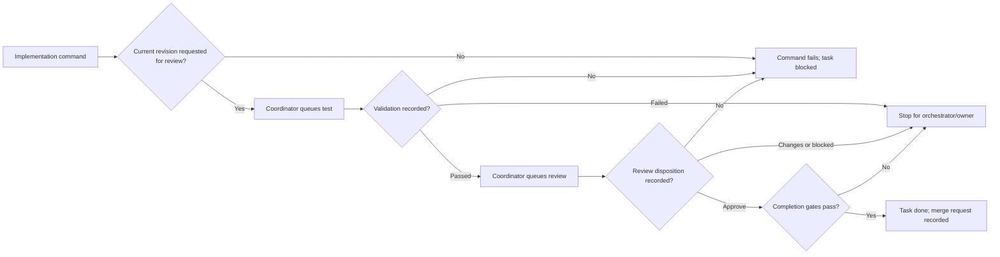

# Automatic phase continuation

Status: Implemented and verified

Last updated: 2026-07-18

## Context

The SQLite command queue is already the durable execution boundary:

- `src/server/store.mjs` (`scheduleOwnerTaskRun`) atomically updates task state,
  queues a phase-scoped command, and records task/audit history.
- `scripts/project-orchestrator.mjs` claims one command, asks the central API to
  execute its Pi phase to settlement, and records command completion.
- `src/server/control-plane.mjs` (`executeTaskPhase`) owns the container, Pi
  session, evidence ingestion, fixed-revision completion check, and cleanup.
- `src/server/store.mjs` (`evaluateCompletion`) owns validation, independent
  review, dependency, and protected-decision gates.

The missing boundary is a model-less reconciliation step after command
completion. The current owner-driven scheduling contract in
`docs/features/workspace-phase-flow/` therefore leaves a successful task
waiting between implementation, test, and review. Making the conversation
orchestrator resend a prompt would add latency and tokens while weakening the
canonical SQLite state machine.

## Proposed changes

### Phase outcome contracts

Add a store-level phase-outcome projection for the task's current revision:

- implementation is settled only when
  `requested_review_revision === revision`;
- test is settled only when a validation row exists for `revision`;
- review is settled only when a review row exists for `revision`;
- the projection exposes passed/failed validation and the latest review
  disposition without interpreting agent prose.

After `executeTaskPhase` returns, validate that the phase produced its required
authoritative evidence. Missing evidence throws a protocol error, causing the
existing failed-command path to block the task and preserve the error.

### Model-less pipeline coordinator

Add a control-plane coordinator that:

1. authorizes the active project orchestrator;
2. asks the store for idle tasks in that project that are already in a
   review-requested fixed-revision pipeline;
3. derives `test`, `review`, `complete`, or `stop` from canonical evidence;
4. resolves the configured route for an automatically selected phase; and
5. calls the existing atomic scheduler with actor/source
   `pipeline-coordinator` / `automatic_phase_continuation`.

Automatic schedule idempotency is
`automatic-phase:<task-id>:<revision>:<phase>`. The existing active-command and
running-session guards remain the concurrency authority.

The coordinator runs:

- immediately after a command is durably completed; and
- before each project command claim, which closes the crash window between
  completion and next-phase scheduling.

No background service, message broker, schema migration, or LLM turn is
required. Reconciliation is a deterministic projection over retained SQLite
state.

### Stop conditions

The coordinator does not queue work when:

- validation exists and is not passed;
- review exists and is not approved;
- the task is blocked or done;
- a decision or dependency gate is open;
- a command or run is active; or
- implementation has never produced a current review request.

The existing manual schedule/resume controls remain the recovery surface.
Automatic rework loops are deferred because a requested change can alter scope
and should return to orchestrator judgment.

### API response and observability

Command completion returns both the completed command and any reconciliation
receipts. Existing schedule audit events already retain actor, source, phase,
route, task version, and command identity, so no parallel event system is
introduced.

Update the workspace phase documentation and cockpit explanation so manual
start is clearly an override. Add a feature result document after verification.

## End-to-end flow

## Testing and validation

- Extend the model-less workflow observer to prove PRODUCT behavior 2–13:
  successful implementation automatically queues test; passed validation
  automatically queues review; approval completes; deterministic replay does
  not duplicate commands.
- Add protocol-outcome cases for missing review request, missing validation,
  and missing review disposition (Behavior 2, 4, 7).
- Add stop-condition cases for failed validation, requested changes, open
  decisions, unresolved dependencies, and active work (Behavior 6, 9, 10).
- Prove untouched Ready tasks are not selected by reconciliation (Behavior 1,
  16).
- Run `npm test`, `npm run test:workflow`, `npm run test:baseline`, and
  `git diff --check`.
- Restart the local API and both orchestrator tmux sessions, then exercise one
  live Ready task selected through the project conversation (Behavior 1, 3,
  5, 8, 11, 15).

## Risks and mitigations

- **Duplicate commands after restart:** deterministic idempotency plus existing
  active-command guards.
- **Advancing from stale evidence:** every directive is pinned to the current
  task revision.
- **Executing planning artifacts:** only tasks already carrying a current
  review request are continuation candidates; Ready selection remains explicit.
- **Infinite repair loops:** failed/non-approved outcomes stop rather than
  automatically rescheduling implementation.
- **Coordinator crash window:** reconciliation before every claim re-derives
  the missing transition from durable state.

## Parallelization

Parallel agents are not proposed. Store projection, API reconciliation, daemon
polling, and the workflow probe share one tightly coupled state machine; a
single implementation sequence reduces conflicting assumptions about
transaction and idempotency semantics.
