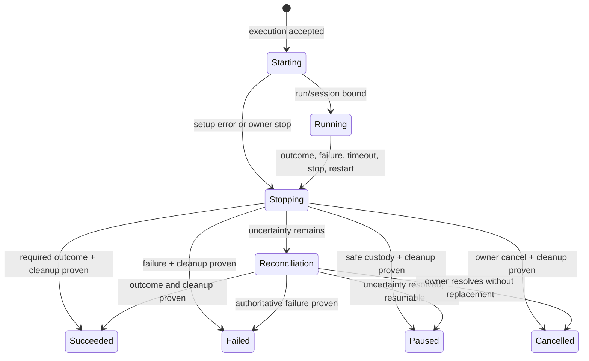

# Execution recovery and late-evidence contract

Status: Implemented; D-057 long-turn deadline remediation verified

Last updated: 2026-07-19

## Context

The product behavior is defined in [`PRODUCT.md`](PRODUCT.md). The Phase 1
closure exposed a mismatch between client request lifetime and authoritative
execution lifetime:

- `scripts/project-orchestrator.mjs:121-185` claims a command, performs one
  long `POST /api/tasks/:id/sessions`, and reports the command succeeded or
  failed from that request result.
- `src/server/control-plane.mjs:1959-1976` keeps that request open while
  `executeTaskPhase` starts and settles the complete Pi phase.
- `src/server/control-plane.mjs:575-760` creates the workspace, credential
  copy, capability, container, Pi process, session, and run, but the
  orchestrator does not learn their identities until the whole phase returns.
- `src/server/control-plane.mjs:772-819` owns provider-response intent and waits
  for Pi settlement with activity-aware timeouts.
- `src/server/control-plane.mjs:826-875` validates the authoritative phase
  outcome and stops the session in `finally`.
- `src/server/store.mjs:4155-4266` lets the project daemon move a claimed
  command directly to Succeeded or Failed. A Failed result blocks the task
  without proving that the API-owned run stopped.
- `src/server/store.mjs:4294-4385` permits owner retry/reset from command state
  alone. It does not fence or inspect a linked run before returning the task to
  Ready.
- `src/server/store.mjs:4529-4566` already provides revocable, run-scoped agent
  capabilities.
- `src/server/store.mjs:5165+` and
  `src/server/control-plane.mjs:1034-1125` already journal and conservatively
  reconcile side effects after restart.
- `src/server/rpc.mjs:25-34,58-75,80-112` already detects Pi exit and
  activity-aware inactivity, but those facts currently surface through the
  long request rather than a durable execution projection.

The durable ingredients are present, but no record exists between a claimed
command and a fully created run. Command completion authority is also split
between the project daemon and central API.

## Implementation design

The implementation now lives in the migration-managed store, central control
plane, project daemon, shared terminal client, and cockpit. The checked-in
model-less recovery probe covers acceptance identity, observer disconnect,
generation fencing, late-checkpoint quarantine, candidate resolution, and
accepted-before-run restart recovery. The initial restart contract
conservatively stops rather than reattaches, and resume copies retained native
Pi JSONL into a new managed execution before invoking Pi with `--session`.

### 1. Add a durable command-execution aggregate

Add a migration-managed `command_executions` table:

```text
id                       immutable execution identity
command_id               unique command identity
project_id, task_id       denormalized scope guards
phase                    immutable phase
state                    starting|running|stopping|paused|failed|
                         reconciliation_required|succeeded|cancelled
version                  optimistic concurrency
generation               mutation fence generation
session_id, run_id        nullable until created; unique when present
workspace_id              nullable until created
base_revision             immutable scheduled base
model_route_json          accepted route
failure_class             stable nullable classification
failure_json              sanitized diagnostics
last_activity_at          meaningful Pi/process activity
accepted_at, started_at
stop_requested_at
stopped_at, settled_at
created_at, updated_at
```

The execution is inserted while the command is claimed and before asynchronous
setup begins. `(command_id)` guarantees one accepted execution; the existing
command idempotency key protects repeated claims/scheduling. Bind session, run,
and workspace identities as each becomes durable.

Keep `orchestrator_commands` as the queue and coarse history. Once an execution
is accepted, the execution aggregate becomes the settlement authority and
projects its terminal state back to the command in the same transaction.
Existing command rows remain queryable.

Add `execution_events` for ordered accepted/started/activity/fence/stop/
classification/settlement events. Reuse existing run events and side-effect
receipts rather than copying their payloads.

### 2. Replace synchronous phase execution with accept-and-observe

Replace the daemon's long `/api/tasks/:id/sessions` call for scheduled work
with:

```text
POST /api/orchestrators/commands/:commandId/executions
Idempotency-Key: execute-command:<commandId>
=> 202 { command, execution }
```

The endpoint verifies the active project-orchestrator lease, claimed command,
task version/base revision, capacity, and route; inserts the Starting execution
and advances the command to Running in one immediate transaction. Repeating
the request returns the existing execution.

Acceptance records the authorized orchestrator identity, then the background
execution uses an internal execution authority derived from that durable
record. It does not retain or require the caller's bearer token after the
request returns. Review completion and other coordinator actions likewise use
the central execution/pipeline actor, so restart recovery never depends on
recovering an old raw lease token.

After the 202 response is committed, the control plane launches
`runCommandExecution(executionId)` outside the request lifetime. A registry of
in-process execution promises prevents duplicate local launches. The durable
execution row, not that registry, is authoritative after restart.

The project daemon becomes an initiator/observer:

1. claim one queued command;
2. accept its execution through the short idempotent endpoint;
3. continue heartbeating and polling;
4. never report an accepted task command Failed/Succeeded from local fetch
   state.

The existing `/complete` endpoint remains only for command kinds whose effects
are wholly daemon-owned, or rejects task-phase completion after an execution
has been accepted. This removes the Phase 1 split-brain path.

Existing active-command and scheduler-capacity queries must count every
nonterminal execution-backed command, not only `queued`/`claimed` rows. A
daemon may resume polling immediately after acceptance, but it cannot claim
overlapping work unless the configured global/project capacity explicitly
permits it.

### 3. Make settlement a central transaction

Refactor `executeTaskPhase` into explicit stages:

1. accept execution;
2. create/bind runtime resources;
3. prompt and observe;
4. evaluate the required authoritative phase outcome;
5. fence and stop runtime resources;
6. classify side effects and late evidence;
7. atomically settle execution + command + task attention;
8. run model-less pipeline reconciliation only after Succeeded.

`startTask` accepts an already-authorized `executionId` and `generation`
instead of reauthorizing with the original lease token, and `createRun`
records the execution link. Starting errors are classified:

- authoritative setup failure when no uncertain side effect or live process
  exists;
- reconciliation required when container/Git/provider identity or completion
  is uncertain.

Successful phase outcome and runtime cleanup are both required before the
command projects Succeeded. A cleanup uncertainty may retain the recorded
phase outcome but holds continuation until reconciled.

### 4. Introduce fencing and stop receipts

Add a store transaction `fenceExecution(executionId, expectedVersion, reason)`
that:

- increments `generation`;
- moves the execution to Stopping;
- revokes all capabilities for the linked run;
- records the stop intent and task attention event; and
- returns the identities that the control plane must terminate.

Every asynchronous host mutation that crosses an `await` boundary carries the
accepted execution generation and rechecks it before advancing task authority.
This is especially important for `GitService.checkpoint`: a commit that
finishes after fencing remains a valid Git operation and recovery candidate,
but it cannot update the task revision automatically.

`stopExecution` then terminates Pi and shell, stops/removes the container,
verifies credential cleanup, ingests final custody/artifacts, and appends one
idempotent stop receipt. Missing proof produces Reconciliation required.

### 5. Classify failures from durable facts

Use stable failure classes rather than raw exception names:

- `setup_failed`
- `pi_process_exited`
- `container_exited`
- `provider_rejected`
- `protocol_error`
- `phase_protocol_violation`
- `rpc_inactive`
- `hard_deadline`
- `owner_stop`
- `control_plane_restart`
- `side_effect_uncertain`

Transport loss by an observing client is not an execution failure class. The
client re-reads the execution by command ID.

Extend Pi RPC event handling to update `last_activity_at` with bounded write
frequency. Process exit triggers immediate fencing. Inactivity and hard
deadline timers call the same fence/stop path, so all failure triggers share
one cleanup and classification contract.

P2-4 found that the implementation's fixed ten-minute `waitFor` ceiling does
not meet this design: one healthy run committed a checkpoint and was still
streaming its final response when the ceiling fired, while another healthy
run settled only five seconds earlier. D-057 proposes configuration shared by
task-phase and orchestrator-turn supervision, a bounded final-settlement
grace, and an absolute ceiling that remains visible without acting as the
ordinary detector. The regression probe must use a synthetic clock/event
stream rather than spend a provider hour.

### 6. Record and resolve late evidence

Add `recovery_candidates`:

```text
id, execution_id, task_id, run_id, workspace_id
kind                     checkpoint initially
state                    pending|accepted|rejected|ineligible
revision, base_revision
evidence_json, proof_json
discovered_at
resolved_by, resolution_reason, resolved_at
version
```

When Git completion or startup reconciliation observes a checkpoint after the
execution generation was fenced, call a model-less verifier:

- repository/workspace/run/task identities match;
- commit exists;
- commit parent/base relationship is proven;
- Git operation and side-effect receipts match;
- task has not advanced from the candidate's expected revision.

Store the proof even when ineligible. Acceptance is an owner-only transaction
that rechecks every proof and expected version, advances the task revision,
invalidates stale validation/review, records an audit event, and invokes the
existing automatic coordinator so fresh validation can be scheduled.

A checkpoint committed before fencing also enters this verifier when later
provider settlement times out. The failure path must not discard or hide
fixed Git evidence merely because the provider-response receipt remains
uncertain.

Rejection changes only the candidate state and audit history. Physical branch
or worktree cleanup is a later retention action.

### 7. Replace reset with explicit recovery actions

Add state-aware owner endpoints:

```text
POST /api/executions/:id/actions
  stop | pause | resume | retry | cancel

POST /api/recovery-candidates/:id/actions
  accept | reject

GET /api/recovery/attention
```

Every mutation requires `Idempotency-Key`, expected version, and reason.
`retry` creates a new phase command from the current task revision only after
the old execution is terminal and reconciled. `resume` creates a new execution
with ancestry pointing to the retained session/custody bundle; it does not
revive an unverified OS process.

Keep the old command reconcile endpoint read-compatible for historical rows.
For new execution-backed commands, return a migration error directing clients
to the explicit execution action. Remove the cockpit's broad Reset label after
the new controls ship.

### 8. Reconcile before dispatch after restart

Extend `reconcileAfterRestart` to begin from nonterminal
`command_executions`, not only `runs`:

1. fence the stored generation;
2. inspect linked container/run/workspace/capabilities;
3. reconcile existing side-effect journals;
4. verify required phase outcome and any checkpoint candidate;
5. stop the old runtime when identity is proven;
6. classify Paused, Failed, Succeeded, or Reconciliation required;
7. settle the linked command transactionally; and
8. only then enable Ready dispatch for that project.

The initial implementation deliberately stops rather than reattaches a live Pi
RPC process. Native Pi JSONL and context custody supply the safe resume path.

### 9. Add a shared attention projection

The attention API joins task, command, execution, run, process/container
inspection, side effects, and recovery candidates into one sanitized
projection. The cockpit and `pink` client render:

- current state and failure class;
- last meaningful activity;
- linked identities and fixed/base revision;
- stop/fence verification;
- uncertain side effects and late candidates;
- only currently valid actions; and
- prior action receipts.

Paused remains a first-class visible state. Existing task cards may show a
compact attention badge; the full recovery panel belongs in task detail.

## State flow



Late recovery candidates are orthogonal records. Accepting one advances the
task revision and creates fresh validation work; it does not change the old
execution to Succeeded.

## Migration and compatibility

- Add schema columns/tables through the existing idempotent store migration
  path.
- Historical terminal commands remain unchanged.
- A pre-migration `claimed` task command with no execution becomes
  Reconciliation required on startup rather than being replayed.
- Historical Failed/Cancelled commands remain historical evidence and do not
  receive synthetic execution rows unless needed for display.
- Update the project daemon and API together; reject an old daemon's attempt
  to complete an execution-backed task command rather than accepting split
  completion authority.

## Testing and validation

Add a model-less `probe-phase2-execution-recovery.mjs` mapping to PRODUCT
behavior:

- one accepted execution under concurrent/repeated starts (1, 6–8, 15);
- client disconnect immediately after acceptance while the run completes
  normally (4, 6, 8–10);
- setup failure before and after a side-effect intent (11);
- Pi exit, protocol error, inactivity, and hard-deadline triggers (12–13);
- capability and Git generation fencing, including a checkpoint completing
  after fence (4, 14–16, 19–22);
- retry/reset denial until stop proof exists (28–32);
- proven late-checkpoint accept, reject, stale-task refusal, and fresh
  test/review requirement (23–27);
- restart at accepted-before-run, running, outcome-recorded-before-settlement,
  and stop-before-receipt boundaries (33–35);
- cockpit/terminal attention parity and paused visibility (2, 5, 17, 36–39).

Fault injection must pause at named durable boundaries rather than rely on
timing sleeps. The probe makes no provider request and uses fake Pi/Docker/Git
adapters where possible.

Then run:

```sh
npm test
npm run test:workflow
npm run test:baseline
git diff --check
```

Live acceptance uses one disposable task with:

1. a normal automatic implementation release;
2. a controlled observer connection drop after execution acceptance;
3. successful fixed-revision test/review settlement without owner repair;
4. a second controlled run stopped after checkpoint intent to exercise the
   late-candidate accept path; and
5. no SQLite edits, probe-only API helpers, duplicate runs, or untracked
   authority changes.

## Risks and mitigations

- **Two overlapping state machines:** keep command as queue/history and
  execution as accepted-work authority; project terminal state in one
  transaction and test forbidden combinations.
- **Fence after an asynchronous Git operation begins:** generation recheck
  prevents task advancement while preserving the commit as evidence.
- **Control-plane process dies with background promises:** durable execution
  records and startup reconciliation, never promise state, decide recovery.
- **Stop damages resumability:** capture native/context custody before
  destructive cleanup when possible and report custody failure explicitly.
- **Recovery UI becomes another generic reset:** derive allowed actions from
  state and require consequence previews/reasons.
- **Automatic acceptance hides bad work:** late checkpoints remain owner-only
  and always require fresh validation/review.

## Parallelization

Do not parallelize the first implementation increment. Store migration,
execution state transitions, async control-plane ownership, daemon protocol,
and the fault probe form one tightly coupled authority boundary. After that
increment is green, cockpit/terminal rendering can be developed in a separate
worktree while the primary implementer adds late-checkpoint verification, but
both should land in one recovery-contract PR and share the model-less probe as
the merge gate.
