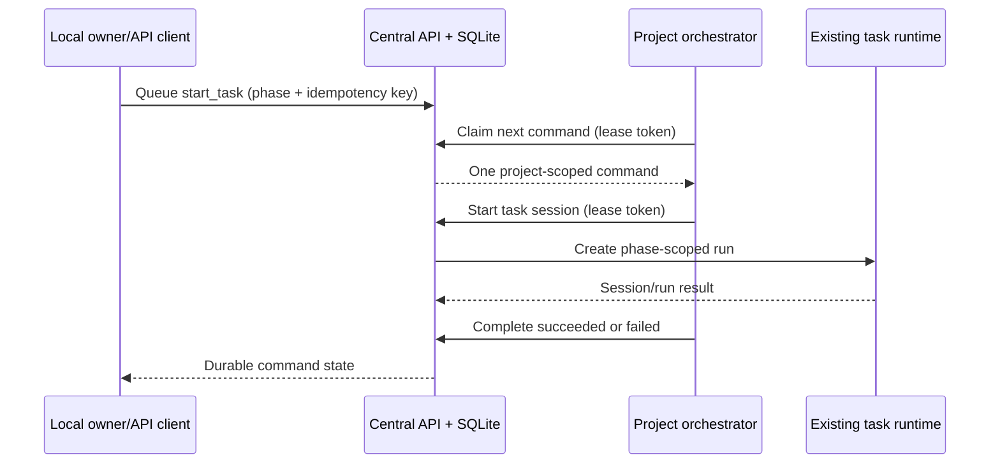

# Phase 1 local control loop — technical specification

Status: Implemented Phase 1 design; see `RESULTS.md`

Last updated: 2026-07-17

## Context

The product behavior is defined in [PRODUCT.md](./PRODUCT.md).

The selected direct-Pi runtime already has the two required authority
boundaries:

- `src/server/store.mjs:51` creates the central SQLite schema and owns all
  durable task, run, audit, and orchestrator-lease state.
- `src/server/store.mjs:435` expires leases, while
  `src/server/store.mjs:441` through `src/server/store.mjs:525` register,
  authorize, heartbeat, release, and list one active orchestrator per project.
- `src/server/control-plane.mjs:627` is the central HTTP routing boundary.
  The existing `POST /api/tasks/:id/sessions` route starts a phase-scoped run
  only for an authorized project orchestrator.
- `scripts/project-orchestrator.mjs` currently registers, heartbeats,
  and releases a lease, but it cannot consume work.
- The loopback operator shell in `src/server/control-plane.mjs:51` is
  read-only and does not display control-loop state.

At implementation time these modules remained under the historical `phase0/`
path to keep this behavioral slice reviewable. They have since graduated,
without a behavioral rewrite, to the stable paths referenced above.

## Proposed changes

### Durable command model

Add `orchestrator_commands` and `orchestrator_command_events` tables to the
existing additive migration:

- commands bind `project_id`, optional `task_id`, the active
  `orchestrator_id`, `kind`, `phase`, request payload/hash, idempotency key,
  lifecycle state, structured terminal result, and timestamps;
- events provide an ordered lifecycle record for `queued`, `claimed`,
  `succeeded`, `failed`, and `reconciliation_required`;
- a global unique idempotency key plus a request hash provides deterministic
  replay or conflict behavior;
- command kinds are allowlisted. This slice implements `start_task`;
- phases reuse the existing `implementation | test | review` allowlist.

Store methods own enqueue, atomic oldest-first claim, terminal completion,
listing, and reconciliation. Claim and completion authorize the bearer token
against the active lease and command project. Tokens and token hashes never
appear in public command objects.

Lease expiry and explicit release move that orchestrator's claimed commands
to `reconciliation_required` in the same store boundary. Queued commands
remain queued for a newly registered orchestrator, with their
`orchestrator_id` rebound only when claimed. No claimed command is returned to
the queue automatically.

### HTTP contract

Add loopback-profile routes:

- `GET /api/commands?projectId=...` lists recent command summaries for the
  cockpit.
- `POST /api/projects/:projectId/commands` queues `start_task`; it requires an
  `Idempotency-Key` header and a body containing `taskId` and `phase`.
- `POST /api/orchestrators/commands/claim` atomically returns the next command
  for the bearer lease, or `204` when none is queued.
- `POST /api/orchestrators/commands/:id/complete` records `succeeded` or
  `failed` plus a structured result.

The queue endpoint does not claim tasks. A `start_task` command can be queued
for a task before it is worker-claimed, but the existing session-start
operation will fail and the orchestrator will durably report that failure.
Automatic local task creation/claiming was implemented by the later Phase 1
task-control and orchestrator-conversation slices.

### Project orchestrator consumer

Extend `scripts/project-orchestrator.mjs` with a bounded polling loop:

1. claim one command from the central API;
2. dispatch the allowlisted command locally;
3. for `start_task`, call the existing task-session route with its lease token
   and selected phase;
4. complete the command with a small structured success value or sanitized
   error details;
5. wait before the next empty claim.

The consumer processes one command at a time. A command failure is terminal
and is not retried. SIGINT/SIGTERM stop further polling and release the lease;
the central store then marks any claimed command for reconciliation.

### Local cockpit

Change the shell label to Phase 1 and add a recent-command panel. It displays
project, kind/phase, task, and lifecycle state. This is observability only;
mutation controls follow after the protocol is proven.

## End-to-end flow

## Testing and validation

- Store-level probe covers invariants 1–6: valid phases, cross-project
  rejection, idempotent replay/conflict, FIFO single claim, wrong-lease
  denial, terminal non-replay, and lease-loss reconciliation.
- HTTP integration uses a temporary central API with two projects and
  orchestrators to cover invariants 1–6 and the public token-redaction
  boundary.
- A child-process integration uses a deterministic fake central server to
  prove the project orchestrator consumes one `start_task`, forwards its
  phase, and reports success/failure without retry (invariant 8).
- The existing direct-foundation, context-custody, task-policy, and restart
  probes remain regression checks.
- A local browser smoke confirms the Phase 1 label and command panel
  (invariant 7).
- Verify the serve command still binds `127.0.0.1` and advertises no
  application authentication (invariant 9).

## Parallelization

Parallel agents are not proposed for this slice. The schema, lease
reconciliation, routes, consumer, and probe share one compact protocol and
need to evolve together; splitting ownership would increase collision and
contract-drift risk more than it would reduce wall-clock time.

## Risks and mitigations

- **Ambiguous side effects after process loss:** claimed work is held for
  explicit reconciliation and never automatically replayed.
- **Wrong-project execution:** both claim and terminal update authorize the
  active bearer lease against the command's project.
- **Queue starvation:** claims are FIFO within a project, and one project
  cannot claim another project's work.
- **Unbounded payload/error retention:** JSON request and terminal result
  bodies are size-limited by the existing HTTP body reader; the orchestrator
  sends sanitized status, message, and returned identifiers rather than raw
  provider output.

## Follow-ups

- Local task create/edit/schedule, stop/resume, and owner reconciliation
  controls are now implemented by later Phase 1 slices.
- The source-tree graduation is complete; continue using `src/`, `scripts/`,
  `tests/`, `config/`, and `infra/` as the stable module boundaries.
