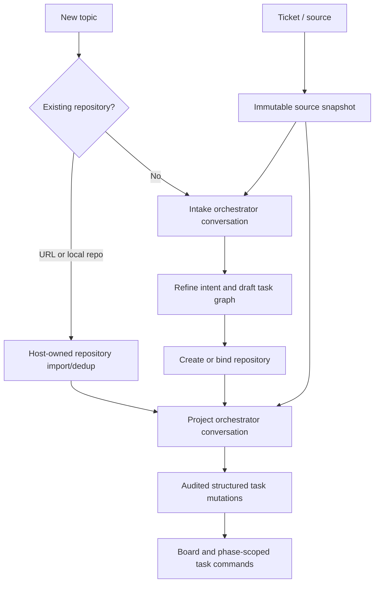

# Phase 1 orchestrator conversations and project intake

Status: Implemented Phase 1 conversation and transfer contract

Last updated: 2026-07-17

## Context

The user-visible contract is in [PRODUCT.md](./PRODUCT.md).

The implementation began from an execution-only orchestration boundary:

- `src/server/store.mjs:53` models projects as rows with a required local
  `repository_path`; tasks and Pi sessions also require project/task binding.
- `src/server/store.mjs:97` and the Phase 1 command tables implement one
  active project-orchestrator lease and durable task commands.
- `scripts/project-orchestrator.mjs` originally consumed only
  `start_task`; it now also owns persistent conversation polling and Pi RPC.
- `src/ui/cockpit.html` retains the direct create/schedule primitive but
  makes a scoped orchestrator conversation the primary intent-refinement path.
- Existing `sessions.task_id` is non-null and represents task-agent Pi
  sessions. Overloading it with pre-project conversation would create fake
  tasks and unclear authority.

The established custody, capability, and side-effect rules still apply:
native Pi JSONL is canonical conversation evidence; the central API owns SQL
state; external effects use intent/completion/reconciliation receipts; agents
never receive host repository or source-provider credentials.

## Proposed changes

### 1. First-class topics and conversation projections

Recommended model:

- `topics`: durable top-level intent with title, state, optional owner
  description, nullable `project_id`, version, and timestamps;
- `topic_events`: append-only owner/orchestrator changes;
- `orchestrator_conversations`: stable conversation identity, scope, native Pi
  session path, state, current run, model/provider, and last processed owner
  message;
- `conversation_events`: owner messages, streaming Pi events, tool calls,
  structured mutations, failures, cancellation, and custody checkpoints;
- `task_origins`: links a task revision to topic, conversation turn, source
  snapshot, and/or parent task;
- `source_attachments` and `source_snapshots`: provider-neutral external
  references and immutable fetched revisions.

Do not make `projects.repository_path` nullable and do not manufacture an
intake task merely to satisfy current foreign keys. Topics are pre-project
intent; projects remain repository-backed execution scopes.

### 2. Orchestrator runtime scope

Introduce an explicit orchestration-scope abstraction:

- `system_intake`: one active intake-orchestrator lease handles unbound topic
  conversations;
- `project:<id>`: the existing one-active-project-orchestrator invariant;
- task commands remain project-scoped and cannot be issued for an unbound
  topic.

The intake process may run multiple durable topic conversations but only one
turn per conversation at a time. When a topic binds to a project, the control
plane snapshots the native session at a safe boundary, records a scope-transfer
event, and lets the project orchestrator resume the same native Pi session.
The stable conversation ID and ancestry do not change.

This should be an additive successor to `project_orchestrators`, not an
in-place semantic expansion hidden inside the current table. Migrate existing
leases into project scopes only after the new path has compatibility tests.

### 3. Conversational Pi authority

Add an orchestrator Pi role with tools narrower than owner authority:

- read topic/project/task/source/context state;
- propose or apply scoped task create/update/split/dependency operations;
- record assumptions, questions, source citations, and progress;
- create protected decision gates;
- request repository creation/import or source refresh through host-owned
  side-effect APIs; and
- enqueue phase-scoped task work only after project readiness.

The system prompt describes readiness criteria and protected decisions. It
does not contain eight fixed questions. Source content is delimited as
untrusted evidence. Tool responses return structured task deltas that the UI
can render independently of prose.

Owner messages are durable commands with idempotency and ordered turn
sequence. The process consumes one, starts/resumes Pi RPC, streams sanitized
events, applies capability-scoped mutations, and ends in a terminal or
waiting-for-owner state. Ambiguous provider/tool effects use the existing
no-automatic-replay reconciliation policy.

The managed runtime now launches one persistent Pi RPC process per active
conversation, using the centrally persisted provider, model, and thinking
level. It sends only the newly claimed owner message to Pi; it never
reconstructs or resends prior conversation history. Pi owns active context,
compaction, and the native JSONL session. `conversation_runs` records the
lease, turn, process, native session path, and effective model route.

The existing `project-orchestrator.mjs` owns both task-command polling and
project-conversation polling in one OS process. During the additive migration
it holds one compatibility `project_orchestrators` lease plus one new
`orchestration_leases` project-scope lease; this is not two project daemons.
The compatibility table can be retired after task-command consumers migrate
to the common scope lease.

A real Pi runtime requires an explicit owner-managed credential source. It is
copied into a private runtime-owned `PI_CODING_AGENT_DIR`; the canonical login
file is never passed to Pi as writable state. The known OAuth concurrency gate
still applies across project/system-intake and task-provider runs until a
broker or verified reconciliation design is approved.

Sanitized text/lifecycle/tool-metadata events are projected into
`conversation_events` with idempotent runtime receipts. Full native Pi JSONL
remains canonical evidence; private reasoning and raw tool bodies do not enter
the browser projection. The orchestrator extension reads authoritative
conversation context and can create, fully refine, split, link, annotate, or
decision-gate project-bound tasks with exact topic/conversation/turn
provenance. Updates use optimistic task versions; dependencies are
same-project and cycle-free, and an unfinished dependency blocks scheduling
and completion of the dependent task. One split tool call creates one ready
child and leaves the parent intact, so the orchestrator can create a reviewable
decomposition without silently inventing a `superseded` state. Unbound topics
cannot mutate executable tasks.

### 3a. Browser and terminal boundary

D-043 is accepted:

- the browser renders Pi RPC conversation events and structured Boss Man task,
  source, decision, and custody projections;
- the browser never owns the Pi process and never synthesizes a replacement
  prompt from stored chat history;
- no browser terminal emulator or raw PTY stream is required for the Phase 1
  orchestrator path; and
- tmux/SSH remains an exact-session operational and recovery attach path.

This is not the original Boss Man “chat wrapper” design. The browser is a
reconnectable view of Pi's persistent native session, while the central API
owns task/audit state. An embedded terminal remains a later option only for
developer workflows that Pi RPC and explicit cockpit controls cannot cover.

The Phase 1 terminal client is another projection over the same local API, not
an attach to Pi stdin. `boss chat` resolves a topic by explicit topic ID,
project ID, or registered repository path; creates the same default
project-orchestrator topic used by the cockpit when one does not exist; prints
the durable turn history and structured mutation events; submits each owner
message once with an idempotency key; and follows only new event sequences
until the submitted turn settles. It also reports the matching scoped lease
and the cockpit deep link. This gives a useful cmux pane without making
terminal escape sequences, shell state, or process scrollback part of the
conversation protocol.

### 4. Repository onboarding

Add a host-owned repository import service:

1. normalize and deduplicate canonical remote URLs without persisting embedded
   credentials;
2. resolve an existing registered project/local clone when possible;
3. journal clone/init intent before network/filesystem effects;
4. use the host's Git/SSH credential mechanism without passing credentials to
   Pi or a task container;
5. clone into a configured owner repository root and inspect the default
   branch/current revision; and
6. atomically register the project and bind the topic after verification.

For new prototypes, a local repository is created only after the owner or
orchestrator explicitly selects “create project”; merely starting a topic does
not produce a junk Git repository.

### 5. External source adapters

Define a small read-only adapter contract:

```text
resolve(reference, credential_profile) -> source identity
fetch(source identity, cursor?) -> immutable snapshot + attachment metadata
```

Provider-specific adapters may be added only when a concrete intake need
appears. Credentials remain in deployment-owned host configuration and are
materialized only into a source-service request, never into Pi context. The
orchestrator receives a normalized, checksum-bound snapshot with provenance
and trust labels.

The first release performs explicit/manual refresh. It has no webhooks,
polling daemon, or source-system write-back. Pasted source text uses the same
snapshot schema with `provider=manual`.

### 6. API and cockpit

Initial local endpoints:

- create/list/open/archive topics;
- attach/bind/import a repository;
- attach/refresh/list source snapshots;
- submit/cancel/resume orchestrator turns;
- stream conversation events;
- list structured turn mutations and linked tasks.

The implemented increments now include topic create/list/open/archive,
conversation turn submit/list, ordered event listing with reconnect cursors,
scoped orchestration lease claim/complete routes, managed persistent Pi RPC
runs, sanitized event ingestion, and provenance-linked task
create/update/split/dependency/assumption/decision tools. Later Phase 1 slices
also implement repository/source endpoints, custody-backed model switching,
and owner task/decision/reconciliation controls. Deeper workspace inspectors
and scope-transfer custody remain. See
[RESULTS.md](./RESULTS.md).

The cockpit adds a prominent **New topic** action and an **Ask orchestrator**
action within each project. The main topic/project workspace uses a
conversation composer beside a task/source/decision inspector. The global
landing page remains attention/fleet oriented, and task workspaces still
default to Overview rather than Conversation.

The first cockpit increment is implemented in `src/ui/cockpit.html`.
It creates and selects topics, reuses the first existing project topic for
**Ask orchestrator**, submits ordered owner turns, polls the durable Pi event
projection, renders completed or in-flight assistant text, displays structured
task-change cards, and refreshes the authoritative board. Direct task creation
remains available in a secondary disclosure. The shell contains no terminal
emulator; tmux/cmux/SSH attach guidance remains visible.

### 7. Context custody

Extend model-less context bundles with optional topic, conversation-turn,
source-snapshot, and task-origin members. Pre-compaction remains blocking and
atomic. A scope transfer from intake to project requires a valid snapshot
before the project orchestrator can resume.

## End-to-end flows



## Testing and validation

- Product invariants 1-4, 17-20: model-less topic/conversation lifecycle,
  ordered turns, reconnect, custody, safe scope transfer, and no concurrent
  turn race.
- Invariants 5-6: temporary local Git remotes prove URL dedup, clone receipts,
  current revision, missing-auth failure, and zero credentials in Pi/container
  state.
- Invariants 7-9, 21: fake provider/manual adapters prove immutable snapshot
  revisions, refresh diffs, provenance, prompt-injection containment, and no
  write-back.
- Invariants 10-15: deterministic Pi provider plus registered orchestrator
  tools proves a clear ticket creates tasks without fixed questioning, vague
  material facts create questions, low-risk assumptions are recorded, and
  protected decisions block.
- Invariants 13-16: API integration proves scope enforcement, idempotent task
  deltas, direct-form compatibility, and task-origin links.
- Invariants 3, 14, 16-19, 22: desktop browser tests cover New topic,
  existing-repository intake, streamed/reconnected turns, structured change
  cards, and actionable failures.
- Invariants 14, 17, 19, 25-26: a model-less terminal probe proves repository
  and topic selection, project-topic reuse, idempotent one-shot submission,
  shared durable history/change projection, browser deep links, and explicit
  offline-orchestrator status.
- Existing command-loop, local-task-control, task-policy, context, foundation,
  and restart probes remain regression gates.

## Implementation sequence

The earlier temporary-worktree plan is complete and intentionally removed from
the active instructions. The integrated feature branch now advances in this
order:

1. audited task-graph mutation tools and cockpit projections — implemented;
2. model-less conversation custody, safe model/provider transfer,
   pre-compaction export, and intake-to-project transfer — implemented;
3. host-owned repository import and immutable source snapshots — implemented;
4. deeper task/source/decision/custody inspectors — implemented;
5. full live-provider phase-flow dogfooding — next.

## Risks and mitigations

- **Chat-first regression:** structured task/source/decision state remains
  independently navigable; conversation is primary ingress, not the global
  information architecture. The conversation is a projection of Pi's native
  session, not a separate history that must be resent.
- **Fake project/task records:** first-class topics avoid weakening repository
  and task invariants.
- **Two orchestration authorities:** all leases, messages, Pi events, and task
  mutations remain central-API records; intake/project processes are leased
  executors only.
- **Private credential leakage:** clone and source access remain host services;
  normalized snapshots and receipts are the only agent-visible inputs.
- **Ticket prompt injection:** external text is low-trust evidence and cannot
  alter capability or system policy.
- **Scope-transfer loss:** a validated model-less snapshot is mandatory before
  resuming the same conversation under a project orchestrator.

## Resolved decisions

1. **Topic data model:** use a first-class pre-project topic rather than
   automatically creating a scratch repository or making projects
   repository-optional. Approved as D-039 on 2026-07-17.
2. **Unbound-topic execution:** use one system-intake orchestrator lease
   that hosts multiple topic conversations, then transfers a conversation to
   the one project orchestrator after binding. Approved as D-040 on 2026-07-17.
3. **External source direction:** use immutable, manually refreshed,
   read-only snapshots for the first release; provider-specific sync,
   write-back, webhooks, and polling are not part of the current design.
   Approved as D-041 on 2026-07-17 and narrowed on 2026-07-18.
