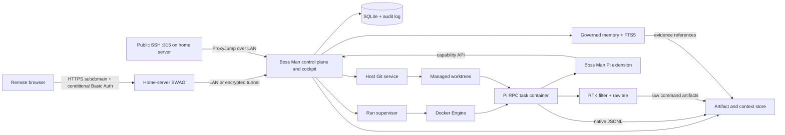
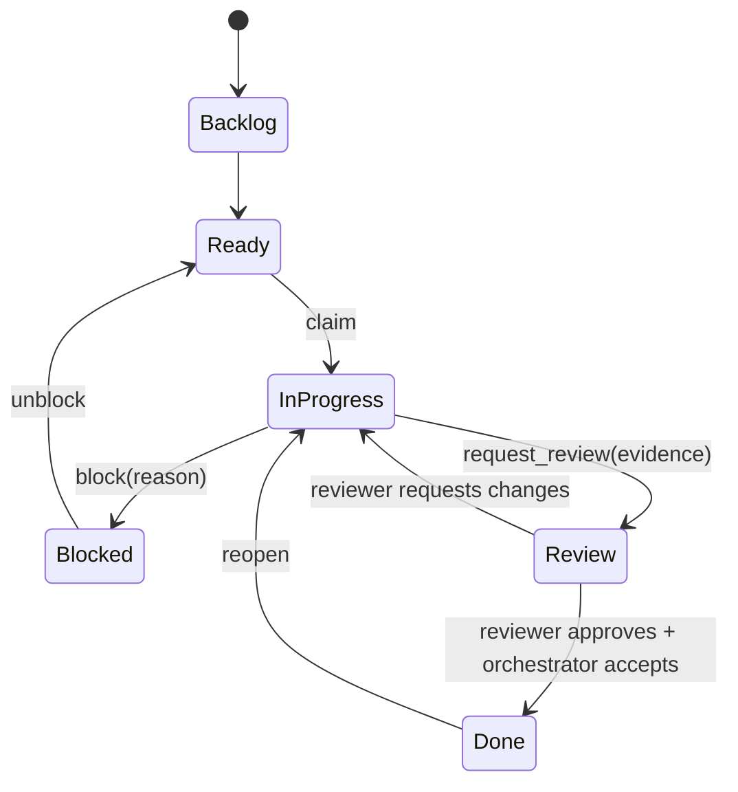
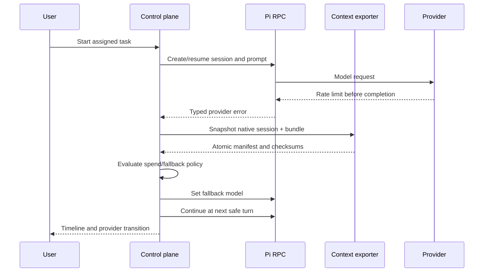

# Boss Man v2 technical design

Status: Direct-Pi foundation approved; Phase 0 closure

Last updated: 2026-07-16

## Context and evidence

This design is based on the following upstream revisions:

- [`weblue/boss-man@59f8282`](https://github.com/weblue/boss-man/tree/59f8282654f9b4cea90f2ba830aa6d56106e25b4)
- [`weblue/inspector-gadget@3df3938`](https://github.com/weblue/inspector-gadget/tree/3df39382ceb147aa411f9c578ef4131fc91912f2)
- [`earendil-works/pi@v0.80.9`](https://github.com/earendil-works/pi/tree/2d16f92973230a7e095aa984f150ba8702784f50)
- [`agent-of-empires@90855a5`](https://github.com/agent-of-empires/agent-of-empires/tree/90855a59360f46652786a49f54a56df002d8ef98)
- [`svkozak/pi-acp@49d6ec8`](https://github.com/svkozak/pi-acp/tree/49d6ec804d40b52317d873360654054c5d2387a3)

The current Boss Man already has a useful SQLite task graph and event history, an SSE-backed web UI, Docker/Sandcastle execution, and worktree-based runs. Its continuation mechanism starts a fresh harness process from a prompt assembled from a rolling LLM summary, recent turns, tasks, and memories. The raw events remain available, but they are not treated as a portable, versioned session artifact.

The existing MCP endpoint grants task mutation to the orchestrator while intentionally limiting worker sessions to a read-only prime operation. The v2 problem is therefore not simply “add update”; it is to add server-enforced, capability-scoped worker mutations and audit them.

Inspector Gadget demonstrates useful remote host setup through Tailscale, SSH, tmux, and cmux. Its Pi copy command exports human-readable conversation content, not the full native session, tool evidence, or a pre-compaction artifact. Its Sandcastle extension also leaves lifecycle policy inside the harness.

Inspector Gadget also pins and installs RTK, wires its Pi extension, and instructs agents to use RTK filters. Current RTK supports Pi command interception, full-output tee artifacts, bypasses, and local savings metrics. This is directly useful when lossless raw evidence remains separate from filtered model context.

The UI/runtime landscape changed the foundation calculation. [Agent of Empires](https://github.com/agent-of-empires/agent-of-empires) already provides an MIT-licensed PWA, terminal and structured views, diffs, persistent workers, worktrees, container adapters, reverse-proxy hardening, an HTTP API, and plugin surfaces. The MIT-licensed [`pi-acp`](https://github.com/svkozak/pi-acp) adapter translates ACP to `pi --mode rpc` while preserving Pi-native sessions. Together they are a credible foundation candidate that did not exist in the original Boss Man design.

The Pi ecosystem now also contains several local memory extensions. [`pi-persistent-intelligence`](https://github.com/Mont3ll/pi-persistent-intelligence) is the closest architectural match because it uses canonical JSONL, rendered Markdown, evidence, tombstones, and patch-governed durable changes. It is a useful spike candidate, but its current maturity is too low to make Boss Man's custody or recovery guarantees depend on it.

## Architectural decision

Build a Pi-native control plane that reuses the proven product concepts from Boss Man, but replace the execution, UI, task-authorization, and context seams instead of incrementally wrapping Sandcastle.

Phase 0 compared two equal candidates: (A) a bounded Agent of Empires core fork running Pi through `pi-acp`, and (B) a direct Pi RPC control plane using SQLite, a task-first web cockpit, the Docker Engine API, and a host-owned Git service. The owner selected the direct-Pi foundation on 2026-07-16. `PHASE0-RESULTS.md` records the evidence and remaining closure gates; `ADR-FOUNDATION.md` records the accepted decision.

Boss Man must have one lifecycle authority. An unchanged Agent of Empires daemon beside an independent Boss Man service is rejected because it duplicates session, worker, worktree, container, authentication, and Git state. AoE is selected only if its reusable runtime and cockpit value exceeds the demonstrated long-term cost of maintaining the necessary core fork; Pi JSONL remains authoritative session evidence in either path.

## High-level architecture



The control plane is authoritative for tasks, policies, runs, workspaces, and artifact provenance. Pi's JSONL is authoritative for native session history. Neither database is reconstructed from an LLM summary.

## Components

### Control-plane API

Responsibilities:

- authenticated private web and API access;
- project, task, dependency, policy, and attention state;
- capability issuance to runs;
- append-only audit events and current-state projections;
- structured event streaming to the browser;
- run lifecycle and recovery coordination;
- provider/model policy evaluation at safe boundaries;
- artifact indexing and download.

The selected direct path owns this API rather than delegating lifecycle to a second session manager. The closure implementation uses a small Node HTTP/SQLite seam to prove transactions; Hono, React, and a supported SQLite binding remain reasonable production choices after the closure gates. `UI.md` defines the required cockpit independently of the server framework.

### Run supervisor

The supervisor creates one managed Pi process per active session/run inside a container and communicates directly with `pi --mode rpc`. It never treats terminal scraping as authoritative. It owns:

- container create/start/stop/inspect/remove;
- Pi RPC requests, responses, and notifications;
- heartbeats and lifecycle reconciliation;
- turn boundaries and idempotency keys;
- model switch and retry decisions;
- log and event ingestion;
- context snapshot triggers.

A browser reconnect only resubscribes to control-plane events. It has no ownership of the underlying process.

### Boss Man Pi extension

The extension is deliberately small and installed into every managed Pi runtime. It should use Pi's documented extension APIs rather than patching Pi internals.

It provides:

- `boss_task_get`
- `boss_task_claim`
- `boss_task_progress`
- `boss_task_block`
- `boss_task_create_child`
- `boss_task_request_review`
- `boss_review_submit`
- `boss_context_snapshot`
- `boss_context_spawn_child`
- `boss_memory_search`
- `boss_memory_propose`
- `boss_git_status`
- `boss_git_diff`
- `boss_git_checkpoint_request`
- `boss_git_commit_request`

Every mutating call carries a short-lived run capability. The server derives project, task, agent role, and permitted transitions from that capability; it never trusts IDs or roles supplied by the model.

The extension listens to `session_before_compact` and blocks automatic compaction until a pre-compaction snapshot succeeds. It also asks for snapshots at turn end, fork/handoff, model switch, provider failure, and manual export. Where a Pi hook cannot safely perform filesystem coordination, it sends a blocking request to the supervisor and waits for acknowledgement.

### RTK output layer

Install a pinned, checksum-verified RTK binary and its Pi extension in the agent image. Disable telemetry by default. Configure RTK to retain complete raw command output while returning the filtered representation to Pi.

For every intercepted command, record:

- original and rewritten command identity, with secret-bearing arguments redacted;
- exit status and timing;
- filtered output delivered to Pi;
- raw output artifact checksum and location;
- RTK version/filter and reported savings;
- whether filtering was bypassed or failed.

Use `tee.mode = "always"` for managed runs because complete-session retention and auditability outweigh the disk savings of failure-only teeing. RTK 0.42.3 also requires explicit `max_files` and `max_file_size` fields during configuration deserialization, so the pinned image supplies those fields rather than relying on the abbreviated upstream example. The artifact quota system handles growth. The UI provides the filtered result by default and one-click raw access. `rtk proxy` is the explicit diagnostic escape hatch.

Do not route control-plane-owned Git mutations through RTK. Tests and build commands may be filtered for agent context, but merge/review policy consumes their exit status plus raw evidence, not the summary alone.

### Context exporter

The exporter is deterministic application code, not a model or prompt. Its outputs are immutable, content-addressed snapshots.

Proposed layout:

```text
artifacts/context/<session-id>/<snapshot-id>/
  manifest.json
  native.pi-session.jsonl
  branch.messages.jsonl
  task.json
  decisions.json
  memory.records.jsonl
  context-receipt.json
  artifacts.json
  git.json
  checksums.sha256
```

`manifest.json` contains a schema version, exporter version, identifiers, trigger, timestamps, selected Pi leaf/branch, model history, source checksums, and references to every member. Files are written to a temporary directory, flushed, checksummed, and atomically renamed before success is acknowledged.

The initial normalized schema should preserve typed Pi entries rather than flattening everything into chat text. Unknown future entry types are copied as opaque typed records so an older exporter does not silently discard them.

The native JSONL supports exact Pi resume/import. The normalized files support inspection, provider changes within Pi, curated child context, and future migrations. Generated summaries may be attached later as optional artifacts but have no role in snapshot validity.

Pi allocates a native session path before it necessarily flushes the file. For pre-conversation and user-only boundaries, the exporter serializes `SessionManager.getHeader()` plus `getEntries()` into the same versioned JSONL shape when the file is absent. The first tested hook where the submitted user message is already persisted in `SessionManager` is `context`; `before_agent_start` and `turn_start` are too early. The synthesized snapshot must reopen through the pinned upstream `SessionManager` before it is accepted.

### Session import and child context

Pi currently exposes native resume/import and SDK session management. Boss Man should use those mechanisms instead of recreating conversation state in a system prompt.

- **Same-session resume:** reopen the managed native JSONL by session ID.
- **Imported resume:** copy and open a validated native JSONL, recording its source manifest.
- **Model switch:** checkpoint, change the model between turns, then continue the same Pi session.
- **Full-context child:** fork the selected Pi session branch.
- **Bundle child:** create a new Pi session with a persistent context message referencing a verified bundle and selected artifacts.
- **Fresh child:** create a new session with task instructions and explicit artifact references only.

For bundle mode, avoid injecting an unbounded transcript into the model window. The child receives a concise deterministic manifest plus tools for retrieving selected records and artifacts. The user or orchestration policy chooses which bundle sections are eager versus on-demand.

The current community `pi-subagents` package already demonstrates session forking, worktrees, artifacts, background agents, model fallbacks, and context builders. It should be evaluated as an upstream dependency or behavioral reference during a time-boxed spike. Its repository did not advertise an SPDX license in the inspected metadata, so no source should be copied until licensing is confirmed.

### Governed memory and retrieval

Boss Man separates four layers that memory products often conflate:

1. **Canonical evidence:** append-only Pi sessions, task/run/audit events, raw tool results, artifacts, Git references, and snapshot manifests. This is lossless, retained until explicit deletion, and independent of every memory library.
2. **Governed durable memory:** typed records with scope, provenance, confidence, status, author, evidence links, staleness metadata, and supersession/tombstone relationships. Mutations are append-only events projected into current state and an inspectable Markdown view.
3. **Derived retrieval:** SQLite FTS5/BM25 is the required model-less index. Optional embeddings, `sqlite-vec`, or an external local index may be added behind a versioned adapter; every derived index can be deleted and rebuilt.
4. **Optional intelligence:** model-assisted extraction, consolidation, semantic reranking, and graph construction may propose candidates or improve ranking. None may silently mutate active memory or become necessary for export, resume, or audit.

Initial memory record fields:

```text
id, schema_version, type, scope_type, scope_id, status,
title, body, confidence, author_type, author_id,
source_refs[], created_at, updated_at, valid_from, expires_at,
supersedes_id, contested_by[], tags[], content_hash
```

The source references point to immutable event IDs, artifact checksums, Pi session entry IDs/line anchors, task revisions, or Git revisions. Retrieval returns records plus a scored explanation; the context assembler writes the final selection to a `context-receipt.json` artifact before the prompt is sent. That receipt records query terms, filters, index version, memory IDs, source references, token estimate, exclusions, and whether retrieval used FTS, optional semantic ranking, or an explicit task attachment.

Memory mutation uses the same capability and optimistic-concurrency pattern as tasks. Workers can propose within their assigned project/task scope. A separate policy action promotes, contests, supersedes, or tombstones a candidate. Repository content and model-generated text are low-trust data: they cannot auto-promote identity/global rules, and retrieved content is delimited as evidence rather than concatenated into the system prompt as instructions. Secret scanning occurs before persistence, while the event records that a rejection or redaction occurred.

The default context assembler is deterministic and budgeted. It starts from explicit task and dependency links, then active project constraints/decisions, applicable runbooks, recent failed approaches, and FTS matches. It excludes superseded/rejected records, labels contested/stale records, and exposes why each item was selected. Full session forks remain available when exact conversational context is more appropriate than retrieval.

The Phase 0/3 memory spike compares two paths:

- embed or adapt the MIT-licensed `pi-persistent-intelligence` contract while Boss Man retains authority, scopes, audit, export, and version pinning; or
- implement the thin contract directly in the Boss Man database and Pi extension, borrowing its governance model without taking a runtime dependency.

The acceptance criterion is not feature count. The selected path must support deterministic export/import, FTS-only operation, deletion/rebuild of indexes, evidence-linked retrieval receipts, task-scoped capabilities, and no automatic package updates. `pi-memctx`, `pi-hermes-memory`, Basic Memory, Graphiti, Mem0, and similar systems remain references or optional adapters rather than canonical stores.

### Task and audit store

SQLite is appropriate for one always-on host if all writes pass through one control-plane service and transactions remain short. Enable WAL, foreign keys, regular online backup, and startup integrity checks.

Core projections:

- `projects`
- `tasks`
- `task_dependencies`
- `task_assignments`
- `sessions`
- `runs`
- `workspaces`
- `providers`
- `model_policies`
- `artifacts`
- `attention_items`

Core append-only records:

- `task_events`
- `run_events`
- `session_events`
- `memory_events`
- `audit_events`

Additional memory projections and indexes:

- `memory_records`
- `memory_candidates`
- `memory_relationships`
- `memory_evidence_refs`
- `memory_fts` (FTS5 virtual table)
- `context_receipts`

Each mutation has an idempotency key and expected projection version. Conflicting versions return a typed conflict; agents must reread rather than overwrite. Deletion is represented by a tombstone where historical provenance matters.

Task state machine:



Capabilities constrain transitions by role. An implementing worker can mutate its assignment and descendants but cannot approve itself. The orchestrator starts a separate read-only reviewer session against a fixed revision. Reviewer output is a structured artifact and task event. After approval and policy-required validation, the orchestrator may request Done and merge without human intervention. A human can override, pause autonomous merging, or require a gate for named risk categories.

The merge policy evaluates changed paths, task risk, independent review, test plan, command results, unresolved findings, conflicts, and repository policy. Documentation-only work may legitimately omit tests; behavior changes normally require regression coverage; cross-boundary changes normally require integration coverage. Any omission carries an explicit reviewer-approved rationale.

Before Done or merge, the policy engine also evaluates human-decision categories. Foundation or fork changes, public contracts and durable schemas, authentication/trust boundaries, secrets strategy, public network exposure, destructive migrations, production infrastructure, external paid services, licenses, retention, and replacement of major runtimes/storage/core dependencies produce a typed `decision_required` event. An ADR proposal can be agent-authored, but only the owner can resolve that event.

### Git and worktree service

Git lifecycle must not depend on prompt compliance.

The host service:

1. creates and validates the branch and worktree;
2. bind-mounts only the worktree files and approved artifact directory into the container;
3. exposes status/diff through capability tools;
4. creates checkpoints and commits on the host after validating task/run ownership;
5. performs merge/rebase only through an explicit human or policy action;
6. removes worktrees only after checking dirty state and durable artifact references.

The common Git directory should not be writable from the agent container. Linked worktree behavior under this restriction is an explicit prototype gate: if normal file operations require metadata writes, provide the minimum isolated metadata view or a workspace representation that is reconciled by the host, rather than mounting the entire repository Git directory writable.

Commit requests include a proposed message and evidence, but the platform generates provenance trailers and rejects unrelated or unsafe paths. Merge conflicts become task/attention state; the service never resets or discards changes automatically.

### Container runtime and credentials

Replace Sandcastle with a narrow runtime adapter over the Docker Engine API. Only the control plane talks to Docker. Containers never receive the Docker socket.

Default container policy:

- non-root user;
- worktree and artifact mounts only;
- read-only base filesystem where Pi/tooling permits;
- CPU, memory, process, and duration limits;
- minimal environment and per-run secrets;
- explicit network mode and egress policy;
- no host home, SSH agent, or global Pi directory mount;
- architecture-compatible pinned image digest.

On macOS, Docker Desktop or OrbStack can supply the Docker API. The adapter boundary should keep that choice replaceable.

Pi OAuth refresh and concurrent access to shared auth state are a risk. The first implementation should never mount `~/.pi` read-write into multiple containers. Prototype one of:

1. a private per-session Pi home initialized from a host credential snapshot and reconciled under a lock; or
2. a host credential broker that supplies short-lived provider credentials without exposing the canonical store.

Direct API and prepaid gateway keys are simpler to scope than consumer OAuth files. Secrets must be redacted before event/artifact persistence.

The repository owns a versioned configuration contract: typed schema, documented environment variables, and redacted examples. Agents may add or validate this contract but never invent or persist real production values. Secret injection is a deployment concern owned by the human; run-scoped credentials are materialized only for the process that needs them and are excluded from context export and memory promotion.

Deployment code is an artifact, not standing deployment authority. Agents may build manifests and start disposable test instances, but must not alter long-lived launch services, SWAG, DNS, router rules, production secrets, or public exposure without explicit authorization for the named operation.

### Provider and model routing

Pi remains the provider adapter. Do not put LiteLLM in the first release merely to normalize provider APIs a second time.

Initial policy:

1. OpenAI-backed Pi authentication/model while included usage is available.
2. Claude, Gemini, OpenRouter, or another supported route selectable manually through configurable model policy and evaluation, not embedded in task code.
3. Prepaid OpenRouter automatic fallback deferred until the core provider/model selection, snapshot, and safe-boundary switch path is proven.

The first release must support a manual safe-boundary model change. Before switching, write a context snapshot and an event describing the old route, failure class, new route, and retry identity. If the last provider request may have completed tool actions, pause for reconciliation instead of replaying. Automatic paid fallback becomes a later policy layer unless the foundation exposes it with little additional risk.

Expose provider health and remaining credit when a stable provider API supports it. Treat missing data as unknown, not zero or unlimited. Model IDs and price tables are configuration refreshed independently of task/session records.

LiteLLM can be reconsidered only if centralized virtual keys, cross-provider budgets, or organization-scale routing become requirements that Pi plus OpenRouter cannot satisfy. If introduced, use a pinned, signed container image and a security update process; never a floating PyPI dependency.

### Remote access

The existing LinuxServer SWAG container and the Boss Man Mac are on the same LAN. SWAG is the public TLS endpoint for a dedicated Boss Man subdomain and proxies HTTP and WebSocket traffic to the Mac's reserved LAN address. The current conditional SWAG Basic Auth remains an outer gate for non-local requests.

The SWAG configuration must preserve `Host`, `X-Forwarded-Proto`, and a controlled client-IP chain; support WebSocket upgrade; disable response buffering for live streams; use long but finite idle timeouts; and set an explicit upload limit for artifacts. Boss Man validates the public Host and Origin, generates external URLs from configured origin rather than untrusted headers, uses Secure/HttpOnly/SameSite cookies, and implements CSRF protection for mutations.

Use one human owner identity in Boss Man itself: an owner passphrase stored as an Argon2id verifier, secure device-bound sessions, login rate limiting, session revocation, and SSH-based recovery/bootstrap. This application session is required even when a local address bypasses SWAG's Basic Auth. The two gates are intentionally independent; SWAG Basic Auth is not accepted as terminal authorization or user identity.

Never expose the upstream origin publicly or run without application awareness that it is behind a proxy. The Mac's application and SSH listeners bind to the LAN or host firewall policy needed for this topology, not a new public router mapping by default.

Keep key-only SSH as a separate recovery path. The existing public port 315 terminates on the home server, which acts as an SSH `ProxyJump` bastion to the Boss Man Mac over the LAN. The RSA private key stays on authorized client devices and is never stored in SWAG, Boss Man, its database, or agent containers. A second router port directly to the Mac is deferred and requires a human network/security decision. Ordinary Cloudflare DNS/HTTP proxying is not treated as an SSH transport; any future Cloudflare Tunnel or Spectrum design is a separate explicit architecture choice.

### Web application

Primary routes:

- `/` attention and fleet dashboard
- `/projects/:id/board`
- `/tasks/:id`
- `/sessions/:id`
- `/runs/:id`
- `/artifacts/:id`
- `/memory`
- `/providers`
- `/settings`

Task detail combines specification/readiness, state, dependencies, assignments, live session, Git changes, tests, independent review, artifacts, timeline, conversation, and an interactive workspace terminal. Session detail combines structured timeline, conversation, terminal, context tree/snapshots, injected-memory receipts, model history, RTK output provenance, and controls. The memory route exposes candidates, active/contested/stale records, governed diffs, and evidence links. The complete layout and candidate evaluation live in `UI.md`.

The direct cockpit is selected. Use xterm.js for terminals and optionally launch code-server as a separately authenticated workspace application. Agent of Empires remains a behavior and interaction reference only; Ghostty and cmux remain local clients rather than server dependencies.

## Critical sequences

### Run and safe fallback



If provider completion is ambiguous or a tool call was in flight, the last two steps are replaced with an attention item and explicit reconciliation.

### Pre-compaction snapshot

1. Pi emits `session_before_compact` with the selected branch.
2. The extension asks the supervisor for a blocking snapshot.
3. The supervisor obtains a stable view or pauses new input.
4. The exporter writes native JSONL, normalized records, manifest, and checksums to a temporary directory.
5. The exporter atomically publishes the snapshot and records it in SQLite.
6. The supervisor acknowledges success; Pi may compact.
7. On failure, compaction is cancelled and an attention item is created.

## API and event principles

- JSON schemas are versioned and checked into the repository.
- Browser, extension, and supervisor use the same typed event envelope.
- Mutation endpoints require idempotency keys and capabilities.
- Capabilities are scoped by action, project, task/session/run, and expiry.
- Secret-bearing payloads are never echoed by default.
- Large event bodies live in content-addressed artifacts.
- Server timestamps are authoritative; source timestamps are preserved separately.
- Schema migrations are transactional and backed up before application.

## Security model

The first release assumes one trusted human owner but a public HTTPS subdomain. It treats internet requests, model output, repository content, tools, and downloaded dependencies as untrusted.

Main controls:

- SWAG TLS plus strong single-owner authentication, Host/Origin validation, CSRF defense, and rate limits;
- least-privilege run capabilities;
- no Docker socket in agents;
- minimal mounts and secrets;
- platform-owned Git mutations;
- immutable audit/context evidence;
- dependency/image pinning and verification;
- artifact redaction and retention policies;
- confirmation for paid fallback and destructive workspace actions; policy evidence for autonomous merge.

Containers reduce accidental host damage but do not stop a determined process from exfiltrating accessible source or credentials over allowed network egress. The UI and documentation must describe this honestly.

## Validation strategy

### Contract tests

- Task role/capability transition matrix.
- Implementer self-approval rejection and fixed-revision reviewer provenance.
- Autonomous merge policy for review findings, required checks, risk classes, and allowed test omissions.
- Human-decision classification and rejection of Done/merge while a protected decision remains unresolved.
- Idempotent mutation and optimistic concurrency behavior.
- Pi RPC request/notification parsing across supported Pi versions.
- `pi-acp` translation fidelity if the Agent of Empires foundation is selected.
- Context schema round-trip including unknown entry types.
- Memory lifecycle/capability matrix, provenance integrity, tombstone behavior, and stale/contested injection rules.
- Deterministic FTS retrieval and context-receipt reproduction with semantic retrieval disabled.
- Native session import and same-session resume.
- Manual model-switch decisions for rate limit, exhausted credit, auth error, and ambiguous completion.
- RTK filtered/raw artifact pairing, redaction, exit status, and savings accounting.

### Integration tests

- Start, stop, crash, and recover Pi containers.
- Snapshot succeeds before compaction; failed snapshot cancels compaction.
- Fork, bundle, and fresh child modes have correct provenance and context.
- Delete and rebuild every memory index, then reproduce FTS results from canonical records.
- Attempt prompt-injection, secret, cross-project, and unauthorized global-memory writes through worker tools.
- Independent reviewer requests changes, re-reviews a new revision, then approves.
- Risk-based validation requires appropriate unit/integration evidence or a reviewer-approved omission rationale.
- Host-owned worktree commit without a writable common Git directory in the container.
- Concurrent task mutations and assignment conflicts.
- Control-plane restart during idle, model response, tool call, and snapshot.
- RTK compression hides no raw evidence and `rtk proxy` bypass remains available.
- SWAG-proxied HTTP, WebSocket terminal, structured streams, uploads, secure cookies, Host/Origin rejection, and reconnect behavior.
- SWAG Basic Auth bypass on the LAN still requires a valid Boss Man owner session.
- Deployment manifests and configuration examples contain no real secrets, and unauthorized long-lived deployment mutations are rejected.

### End-to-end acceptance

Automate the first-release behaviors in `PRODUCT.md` §14, including a reviewer/change-request loop, autonomous platform-owned merge for an unprotected change, a blocked merge requiring an owner architecture decision, forced provider failure with manual model switch, SWAG WebSocket reconnect, and a full host-service restart. Verify artifacts by checksums and by importing the exported native session into a new managed Pi runtime. Use Playwright for the cockpit's critical desktop/mobile flows and retain screenshots or traces for failed UI tests.

## Delivery plan

### Phase 0: feasibility gates

Time-box prototypes for the highest-risk assumptions before broad UI work:

1. Run equal, narrow prototypes for the AoE core-fork candidate and the direct Pi RPC candidate. Score both against `FOUNDATION.md`: one lifecycle authority, Pi session/context fidelity, pre-compaction interception, task/control APIs, full cockpit route, host-owned Git, run-scoped credentials, testability, patch size, and an upstream rebase rehearsal.
2. Exact native session resume/import and cross-model continuation through the selected foundation.
3. Blocking, model-less pre-compaction export through a Pi extension, including through `pi-acp` if selected.
4. RTK Pi interception with `tee.mode = "always"`, raw artifact ingestion, redaction, savings metrics, and diagnostic bypass.
5. Host-owned worktree/status/commit with restricted Git metadata mounts or the selected foundation's equivalent custody controls.
6. Safe concurrent credential refresh or per-session credential isolation.
7. SWAG subdomain proxy to the target Mac, including authentication, Host/Origin enforcement, WebSockets, live streams, artifact transfers, and reconnect.
8. Governed memory and retrieval proof: typed candidate, evidence-linked promotion, authoritative SQL separation, FTS5 recall benchmark, context receipt, export/import, index deletion/rebuild, cross-scope/poisoning tests, and a time-boxed `pi-persistent-intelligence` assessment. Run an optional disposable vector comparison only after recording the FTS5 baseline.

`PHASE0.md` defines the common fixture, hard gates, scorecard, evidence schema, and execution order. Each spike produces a small executable test and an ADR. Failure changes the architecture before feature implementation.

### Phase 1: single-session vertical slice

- Project registration and one task.
- SQLite migrations and audit/event envelope.
- One managed Pi container and live structured timeline plus workspace terminal.
- Native session persistence and manual deterministic snapshot.
- RTK filtered output with retained raw artifact.
- Managed worktree plus host status/diff.
- Single-owner cockpit through SWAG.

### Phase 2: task control and Git custody

- Full task state machine, dependencies, attention queue, and worker capability tools.
- Agent progress/child-task/review operations.
- Independent read-only reviewer loop and structured report.
- Risk-based unit/integration validation policy.
- Host checkpoint/commit, autonomous policy-governed merge, and validation evidence.
- Typed human-decision gates, ADR proposals, owner resolution, and audit evidence.
- Recovery reconciliation and operator overrides.

### Phase 3: context and subagents

- Automatic pre-compaction and lifecycle snapshots.
- Context browser and artifact download.
- Fresh, bundle, and full fork child modes.
- Governed project memory, candidate review, FTS retrieval, context receipts, and memory inspector.
- Retention, redaction, import, and provenance validation.
- Optional semantic-retrieval benchmark; ship only if it materially improves recall over FTS without weakening portability.

### Phase 4: model policy and provider resilience

- Provider health and billing-mode display.
- Safe-boundary manual model switching and failure drills.
- Model/task policy evaluation using a checked-in benchmark suite.
- Decide whether prepaid OpenRouter automatic fallback adds enough value to implement; if so, add spend caps and ambiguity-safe continuation.

### Phase 5: hardening and fleet UX

- Concurrency controls and resource telemetry.
- Backup/restore drills, image verification, dependency audit, and update flow.
- Cockpit usability hardening and external browser-IDE integration.
- Versioned deployment/configuration package and operator runbook, stopping before long-lived deployment mutation.
- Notification integrations only if later authorized.

## Parallelization

Phase 0 should remain mostly sequential because the foundation decision changes language, process ownership, event transport, and UI extension boundaries. Parallel implementation before that decision would produce throwaway adapters.

After the foundation and schemas are fixed, three bounded tracks can run in parallel in separate worktrees and land as a coordinated PR series:

| Agent role | Mode and worktree | Branch | Ownership and landing |
|---|---|---|---|
| Pi context/runtime | Local, `/Users/ND139178/Documents/worktrees/boss-man-pi-runtime` | `codex/bmv2-pi-runtime` | Pi extension, snapshot exporter, RTK ingestion, RPC/ACP adapter tests; lands first after shared schemas |
| Task/Git policy | Local, `/Users/ND139178/Documents/worktrees/boss-man-task-policy` | `codex/bmv2-task-policy` | task events, capabilities, reviewer workflow, validation and merge policy, host Git service |
| Cockpit/SWAG | Local, `/Users/ND139178/Documents/worktrees/boss-man-cockpit` | `codex/bmv2-cockpit` | board/task workspace/terminal UI, reverse-proxy deployment, Playwright tests; consumes mocked schemas until runtime lands |

The main integration agent owns schema definitions, migrations, shared generated clients, final merges, and end-to-end validation. Each track avoids editing shared schema files without first messaging the integration agent. Prefer one PR per track followed by a small integration PR rather than three agents committing to one branch.

## Risks and unresolved constraints

1. **Pi API stability:** RPC, session JSONL, and extension hooks can evolve. Pin a tested Pi version, wrap it behind adapters, and retain unknown event types.
2. **OAuth concurrency:** shared consumer credentials may race or be invalid for isolated processes. Complete the credential spike before parallel runs.
3. **Exactly-once side effects:** provider failure after a tool call cannot always be classified automatically. Prefer pause-and-reconcile over replay.
4. **Git metadata isolation:** linked worktrees normally reference a shared common Git directory. Prove the mount design before promising strict Git custody.
5. **Secret persistence:** raw tool results can contain credentials. Redaction must occur before durable event capture, while preserving evidence that redaction occurred.
6. **Disk growth:** lossless session and artifact custody requires quotas, retention choices, and backups. Compaction must not double as deletion.
7. **Single-host availability:** the always-on Mac remains a failure domain. v1 should support backups and restart recovery, not pretend to be highly available.
8. **Provider policy drift:** subscription and third-party OAuth rules can change independently. Billing mode must be visible configuration, not a code assumption.
9. **Supply-chain exposure:** agent images execute large toolchains and downloaded code. Pin images and dependencies and avoid unnecessary routing infrastructure.
10. **Foundation fork burden and authority split:** Agent of Empires moves quickly, includes many non-Pi paths, exposes only narrow host-rendered plugin surfaces, and currently permits both daemon and TUI ownership of session metadata. Its own open architecture work proposes daemon ownership. Adopt only as a bounded core fork with one lifecycle authority, a measured patch surface, upstream issue/PR intake, automated compatibility tests, and a successful rebase rehearsal.
11. **ACP translation loss:** pinned `pi-acp` reaches the Pi pre-compaction hook, preserves native model/abort state, reloads sessions, and translates active-turn notifications. It misses extension `session_start` notifications emitted before the bridge subscribes, and extension slash commands are not exposed. Treat Pi JSONL and custody manifests as authoritative; do not make startup UI notifications or extension slash commands part of required control-plane correctness.
12. **Public terminal exposure:** a SWAG subdomain makes authentication, proxy-header trust, origin checks, WebSocket controls, and recovery-code handling release blockers rather than optional hardening.
13. **RTK evidence divergence:** filtered output can omit relevant detail. Preserve raw output for every managed command and make policy decisions from exit state plus raw evidence.
14. **Memory poisoning:** repository text or a compromised agent can attempt to persist instructions for future sessions. Enforce scope capabilities, provenance, trust classes, secret scanning, review gates, and delimited data-only injection.
15. **Stale or contradictory memory:** durable claims can outlive the code that made them true. Track source revisions, expiry/supersession, contested state, and retrieval receipts; prefer live repository inspection when confidence or freshness is insufficient.
16. **Memory dependency churn:** current Pi memory packages are young and may change rapidly. Pin reviewed versions, prohibit auto-update, keep the Boss Man schema/export contract first-party, and make the dependency removable.

## Implementation gate

The owner resolved the foundation ADR in favor of direct Pi on 2026-07-16. Begin with the bounded Phase 0 closure vertical slice: integrate task policy, runtime/Git/credentials, active recovery, governed context retrieval, and real owner authentication behind the selected daemon authority. Do not broaden into the production cockpit backlog until those candidate-level tests and the second clean ARM64 reproduction pass. Phase 0 evidence and conditions are summarized in `PHASE0-RESULTS.md`.
